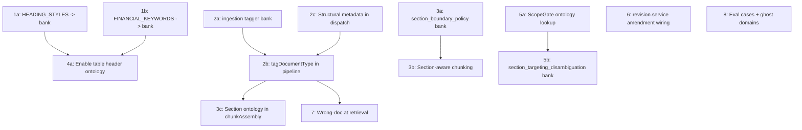

<!-- 105d1ebc-4795-4300-a598-9027be951d37 -->
---
todos:
  - id: "phase1a-heading-ssot"
    content: "Replace hardcoded HEADING_STYLES in docxExtractor with bank-loaded data (extraction_heading_levels.any.json)"
    status: pending
  - id: "phase1b-keywords-ssot"
    content: "Replace hardcoded FINANCIAL_KEYWORDS in xlsxExtractor with bank-loaded data (extraction_financial_keywords.any.json)"
    status: pending
  - id: "phase2a-tagger-bank"
    content: "Create ingestion_doc_type_tagger.any.json with fingerprinting rules for common doc types"
    status: pending
  - id: "phase2b-pipeline-tagging"
    content: "Add tagDocumentType() to documentPipeline.service.ts after extraction, before chunking"
    status: pending
  - id: "phase2c-structural-metadata"
    content: "Enhance extractionDispatch return type to pass headings/tableSignatures upstream"
    status: pending
  - id: "phase3a-section-policy"
    content: "Create section_boundary_policy.any.json for section-aware chunking rules"
    status: pending
  - id: "phase3b-section-chunking"
    content: "Wire chunking.service.ts to accept and respect section boundaries"
    status: pending
  - id: "phase3c-assembly-ontology"
    content: "Wire chunkAssembly.service.ts to load di_section_ontology for section label enrichment"
    status: pending
  - id: "phase4a-table-ontology"
    content: "Decouple table_header_ontology from compiled artifacts flag; wire into extractors"
    status: pending
  - id: "phase4b-extraction-strategy"
    content: "Create table_extraction_strategy.any.json for per-domain table extraction policy"
    status: pending
  - id: "phase5a-scopegate-ontology"
    content: "Replace scopeGate regex section disambiguation with di_section_ontology + per-doc-type section lookup"
    status: pending
  - id: "phase5b-section-disambiguation-bank"
    content: "Create section_targeting_disambiguation.any.json for ambiguous section references"
    status: pending
  - id: "phase6-revision-amendment"
    content: "Wire revision.service.ts to load and apply amendment_chain_schema patterns at runtime"
    status: pending
  - id: "phase7-wrongdoc-retrieval"
    content: "Store docTypeId in Pinecone metadata; add domain-level retrieval filtering"
    status: pending
  - id: "phase8a-golden-evals"
    content: "Add 10 GOLD-* eval cases to appropriate .qa.jsonl files"
    status: pending
  - id: "phase8b-natural-queries"
    content: "Create section_detection_natural_queries.qa.jsonl with ~50 natural-language queries"
    status: pending
  - id: "phase8c-adversarial-sections"
    content: "Create wrong_section_adversarial.qa.jsonl with ~20 cross-doc-type section confusion cases"
    status: pending
  - id: "phase8d-ghost-domains"
    content: "Resolve ghost domains (compliance, education_research, procurement) — create catalogs or remove from type union"
    status: pending
isProject: false
---
# Document Identity & Structure — Remediation Plan (46 -> ~80)

The audit reveals a pattern: rich banks exist but runtime ignores them. The fix is primarily **wiring**, not authoring new content. The plan is ordered by score impact.

---

## Phase 1: SSOT Violations (Maintainability 2->4, +2 pts)

Easiest wins — remove hardcoded constants and load from existing banks.

### 1a. `docxExtractor` — replace `HEADING_STYLES` with bank

- **File:** `backend/src/services/extraction/docxExtractor.service.ts` (lines 32-52)
- The constant `HEADING_STYLES` maps OOXML style names to heading levels (EN + PT).
- **Action:** Import `dataBankLoader`, load the `doc_archetypes` bank (which already has `structureSignatures.headings` per doc type), or create a slim `extraction_heading_levels.any.json` bank registered in `bank_registry.any.json`. The extractor should call `bankLoader.getBank('extraction_heading_levels')` at init and fall back to the current hardcoded map if bank unavailable.
- Register the new bank in `manifest/bank_registry.any.json`, `bank_checksums.any.json`, `bank_dependencies.any.json`.

### 1b. `xlsxExtractor` — replace `FINANCIAL_KEYWORDS` with bank

- **File:** `backend/src/services/extraction/xlsxExtractor.service.ts` (lines 34-84)
- 51 hardcoded financial keywords (EN + PT).
- **Action:** Create `extraction_financial_keywords.any.json` in `data_banks/semantics/`, domain-keyed, bilingual. Register in manifests. Loader call: `bankLoader.getBank('extraction_financial_keywords')`. Fallback to hardcoded if missing.

---

## Phase 2: Ingestion-Time Doc-Type Tagging (Doc Type 15->21, +6 pts)

The single highest-impact missing capability. Currently docs enter the system untagged.

### 2a. Create `ingestion_doc_type_tagger.any.json`

- **Location:** `data_banks/document_intelligence/`
- **Content:** Lightweight fingerprinting rules per doc type — keyword density patterns, structural cues (from `doc_archetypes.structureSignatures`), and header pattern matches (from per-domain `doc_type_catalog` detection patterns).
- Keep it lean: ~50 high-confidence rules for the most common/confusable types.

### 2b. Add `tagDocumentType()` to `documentPipeline.service.ts`

- **File:** `backend/src/services/ingestion/pipeline/documentPipeline.service.ts`
- **Insert point:** After extraction succeeds (~line 215), before chunking.
- **Logic:**
  1. Load `ingestion_doc_type_tagger` bank via `dataBankLoader`.
  2. Run extracted text + structural metadata (headings, table signatures) against fingerprinting rules.
  3. Produce a `docTypeId` + `domainId` + `confidence` score.
  4. Attach to document metadata (Prisma `Document` model already has fields or add via migration).
  5. Pass `docTypeId` downstream to chunking and embedding (Pinecone metadata).

### 2c. Wire `extractionDispatch` to pass structural metadata

- **File:** `backend/src/services/ingestion/extraction/extractionDispatch.service.ts`
- Currently returns only text. Enhance return type to include `headings: string[]`, `tableSignatures: string[]` from extractor output — data already available from DOCX/PDF extractors but discarded by the dispatch layer.

---

## Phase 3: Section-Aware Chunking (Section 8->15, +7 pts)

### 3a. Create `section_boundary_policy.any.json`

- **Location:** `data_banks/document_intelligence/`
- **Content:** Policy rules: prefer section-boundary splits when heading detected, min/max chunk sizes per section type, overlap policy at section transitions.

### 3b. Wire `chunking.service.ts` to respect section boundaries

- **File:** `backend/src/services/ingestion/chunking.service.ts`
- **Current behavior:** Splits on `\n\n` and character count only.
- **Change:** Accept optional `sectionBoundaries: { offset: number; heading: string }[]` parameter. When provided, prefer splitting at section boundaries. Fall back to current behavior for unstructured text.
- Load `section_boundary_policy` bank for configurable thresholds.

### 3c. Wire `chunkAssembly.service.ts` to load section ontology

- **File:** `backend/src/services/ingestion/pipeline/chunkAssembly.service.ts`
- When `docTypeId` is known (from Phase 2), load per-doc-type sections via `dataBankLoader` and use them to validate/enrich section labels on chunks.

---

## Phase 4: Table Header Ontology Activation (Table 6->13, +7 pts)

### 4a. Enable table header ontology in extractors

The 15 domain-specific `table_header_ontology.*.any.json` files exist with priority-weighted headers and disambiguation rules, but are gated behind `BANK_COMPILED_ARTIFACTS_ENABLED` (defaults off).

- **Action:** Decouple table header ontology from compiled artifacts. Register the 15 files as standard banks (not compiled-only) in `bank_registry.any.json`.
- Add bank loading to:
  - `docxExtractor.service.ts` — match extracted table headers against ontology for canonical naming
  - `pdfExtractor.service.ts` — same for heuristic table detection
  - `xlsxExtractor.service.ts` — match sheet headers against ontology

### 4b. Create `table_extraction_strategy.any.json`

- Per-domain policy: markdown-table vs key-value extraction, expected column counts, header-row detection rules. Consumed by all three extractors.

---

## Phase 5: ScopeGate Section Disambiguation (Disambiguation 5->8, +3 pts)

### 5a. Replace regex heuristic with ontology lookup

- **File:** `backend/src/services/core/scope/scopeGate.service.ts` (lines ~1290-1340)
- **Current:** Hardcoded regex `(clause|section|part|article|cláusula|seção|artigo)` + synthetic sub-section generation.
- **Change:** Load `di_section_ontology` (600+ entries) and per-doc-type sections. When a section reference is detected:
  1. Look up candidate sections from the ontology for the active doc type.
  2. If multiple matches, generate disambiguation candidates from actual bank entries (not synthetic 3.1/3.2/3.3).
  3. Fall back to regex only when doc type is unknown or bank lookup yields zero matches.

### 5b. Create `section_targeting_disambiguation.any.json`

- Bank defining ambiguous section references per doc type that should trigger clarification ("the termination clause" -> ask which: for Convenience vs for Cause).

---

## Phase 6: Version Chain Runtime Resolution (Version 5->8, +3 pts)

### 6a. Wire `revision.service.ts` to use `amendment_chain_schema`

- **File:** `backend/src/services/documents/revision.service.ts`
- **Current:** Hardcodes `"amends"` relationship type. Ignores schema's 5 relationship types and detection patterns.
- **Change:** Load `amendment_chain_schema` bank. Use its regex patterns to detect relationship type from document text/filename. Apply version status resolution (`latest_effective_date_wins`) when multiple versions exist.

---

## Phase 7: Wrong-Doc Prevention at Ingestion (Wrong-Doc 5->7, +2 pts)

With doc-type tagging from Phase 2:
- Store `docTypeId` in Pinecone metadata during embedding.
- At retrieval time, filter by `domainId` when query domain is unambiguous.
- This shifts wrong-doc prevention from post-hoc quality gate to retrieval-level filtering.

---

## Phase 8: Eval Cases & Ghost Domains (+2-3 pts across criteria)

### 8a. Add 10 golden eval cases

Add the 10 `GOLD-*` cases from the audit to appropriate `.qa.jsonl` files:
- `GOLD-DIS-001`, `GOLD-DIS-002`, `GOLD-CROSS-009` -> doc type disambiguation
- `GOLD-SEC-003`, `GOLD-SEC-008` -> section disambiguation
- `GOLD-VER-004`, `GOLD-STRUCT-010` -> version chain
- `GOLD-WRONG-005`, `GOLD-WRONG-006` -> wrong doc traps
- `GOLD-TBL-007` -> table context

### 8b. Add natural-language section detection queries

Create `section_detection_natural_queries.qa.jsonl` with ~50 natural-language section queries (not the mechanical template pattern).

### 8c. Add adversarial section targeting tests

Create `wrong_section_adversarial.qa.jsonl` with ~20 cross-doc-type section confusion cases.

### 8d. Ghost domain catalogs

Create minimal `doc_type_catalog.any.json` for `compliance`, `education_research`, `procurement` if they're in the type union — or remove them from the union. Verify against `domain_ontology.any.json`.

---

## Dependency Graph

## Expected Score Impact

- Doc type detection: 15 -> ~21 (+6)
- Section ontology: 8 -> ~15 (+7)
- Table type detection: 6 -> ~13 (+7)
- Version/amendment: 5 -> ~8 (+3)
- Disambiguation: 5 -> ~8 (+3)
- Wrong-doc prevention: 5 -> ~7 (+2)
- Maintainability/SSOT: 2 -> ~4 (+2)
- **Total: 46 -> ~76-80 (C+ to B-)**
