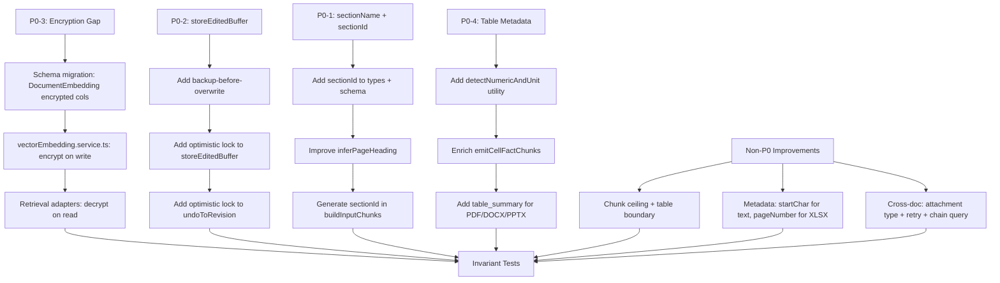

<!-- 9a7e38e5-e87e-4d79-afd4-9fc51bf55280 -->
---
todos:
  - id: "p0-3-schema"
    content: "P0-3: Add contentEncrypted/chunkTextEncrypted columns to DocumentEmbedding in schema.prisma + migration"
    status: pending
  - id: "p0-3-encrypt-write"
    content: "P0-3: Encrypt DocumentEmbedding.content/chunkText and DocumentChunk cell metadata in vectorEmbedding.service.ts when encrypted_only mode"
    status: pending
  - id: "p0-3-decrypt-read"
    content: "P0-3: Update retrieval adapters to decrypt DocumentEmbedding columns on read when plaintext is null"
    status: pending
  - id: "p0-2-backup"
    content: "P0-2: Add backup-before-overwrite to storeEditedBuffer (mirror applyEdit pattern)"
    status: pending
  - id: "p0-2-optimistic-lock"
    content: "P0-2: Add expectedDocumentFileHash optimistic lock to storeEditedBuffer and undoToRevision"
    status: pending
  - id: "p0-1-section-id"
    content: "P0-1: Add sectionId to InputChunkMetadata, schema.prisma, and generate deterministic hash in buildInputChunks"
    status: pending
  - id: "p0-1-heading-heuristic"
    content: "P0-1: Improve inferPageHeading to scan multiple lines, detect centered text, use outline fallback"
    status: pending
  - id: "p0-4-numeric-unit"
    content: "P0-4: Add detectNumericAndUnit utility and enrich emitCellFactChunks with unitRaw/unitNormalized/numericValue/cellRef/rowLabel/valueRaw"
    status: pending
  - id: "p0-4-table-summary"
    content: "P0-4: Add table_summary chunks for PDF/DOCX/PPTX tables (mirror XLSX pattern)"
    status: pending
  - id: "nonp0-chunking"
    content: "Chunking: Add markdown table boundary detection and chunk-size ceiling enforcement after overlap"
    status: pending
  - id: "nonp0-metadata"
    content: "Metadata: Add startChar/endChar to text fallback chunks, pageNumber to XLSX chunks, multi-header colHeader paths"
    status: pending
  - id: "nonp0-crossdoc"
    content: "Cross-doc: Add attachment type, retry link creation, add getAmendmentChain transitive walk"
    status: pending
  - id: "tests"
    content: "Create indexingStorageAudit.invariants.test.ts with the 5 invariant tests from the audit spec"
    status: pending
isProject: false
---
# Indexing & Storage Audit Remediation Plan

## P0 Blockers (Critical / High)

### P0-3: Encryption at Rest Gap (Critical) — +4 pts

The pipeline encrypts `DocumentChunk.text` into `textEncrypted` and nulls plaintext when `encryptionMode === "encrypted_only"` (in `vectorEmbedding.service.ts:413-428`). However, `DocumentEmbedding.content` and `chunkText` are **always plaintext** (lines 371-389). Cell metadata (`valueRaw`, `rowLabel`, `colHeader`) in `DocumentChunk` is also unencrypted.

**Files:**
- `backend/prisma/schema.prisma` (lines 357-383) — add `contentEncrypted String?` and `chunkTextEncrypted String?` to `DocumentEmbedding`
- `backend/src/services/retrieval/vectorEmbedding.service.ts` (lines 371-389) — in encrypted mode, encrypt `content` and `chunkText`, null plaintext; also encrypt cell metadata fields in `DocumentChunk` records
- `backend/src/services/core/retrieval/prismaRetrievalAdapters.service.ts` — update `resolveSemanticFallbackChunks` and `resolveChunkTexts` to decrypt `DocumentEmbedding` columns when plaintext is null
- New migration for the two new columns

**Approach:**
1. Add `contentEncrypted` / `chunkTextEncrypted` columns to `DocumentEmbedding` schema
2. In `vectorEmbedding.service.ts`, mirror the `DocumentChunk` encryption pattern for `DocumentEmbedding` records: when `encryptionMode === "encrypted_only"`, encrypt content/chunkText and null the plaintext columns
3. Encrypt sensitive `DocumentChunk` metadata fields (valueRaw, rowLabel, colHeader) in the same block — store as encrypted JSON in a new `metadataEncrypted` column, or encrypt individual fields
4. Update retrieval adapters to decrypt on read

---

### P0-2: storeEditedBuffer Data-Loss Vector (Critical) — +3 pts

`storeEditedBuffer` (documentRevisionStore.service.ts:2009-2132) overwrites the file at the same storage key **without creating a backup**, unlike `applyEdit` (lines 1721-1759) which always runs `revisionService.createRevision()` first and aborts on backup failure.

Additionally, `undoToRevision` has no optimistic concurrency check — it reads current bytes, backs up, then restores without verifying the document wasn't mutated in between.

**File:** `backend/src/services/editing/documentRevisionStore.service.ts`

**Approach:**
1. In `storeEditedBuffer`, add the same backup-before-overwrite pattern from `applyEdit`: call `revisionService.createRevision()` with `reason: "backup:storeEditedBuffer"` before `uploadFile`, abort if backup fails
2. Add `expectedDocumentFileHash?: string` to `storeEditedBuffer`'s input type; compare against `doc.fileHash` before overwriting (same pattern as lines 617-634)
3. In `undoToRevision`, add an optimistic lock: accept `expectedFileHash` param, compare against current doc hash before restore
4. Audit `KODA_EDITING_KEEP_UNDO_HISTORY`: it IS read in prod (`documents.routes.ts:393-396`) but only set in tests — ensure it is documented and has a default in env config

---

### P0-1: Fragile PDF sectionName Heuristic + No sectionId (High) — +3 pts

`inferPageHeading` (chunkAssembly.service.ts:69-92) only checks the first line of page text. Multi-line headings, centered titles, and non-heading first lines produce `undefined sectionName`. There is no `sectionId` field for stable structural identification.

**Files:**
- `backend/src/services/ingestion/pipeline/chunkAssembly.service.ts` (lines 69-92) — improve `inferPageHeading`
- `backend/src/services/ingestion/pipeline/pipelineTypes.ts` (lines 56-91) — add `sectionId` to `InputChunkMetadata`
- `backend/prisma/schema.prisma` — add `sectionId String?` to `DocumentChunk`

**Approach:**
1. Add `sectionId?: string` to `InputChunkMetadata`
2. Generate `sectionId` as a deterministic hash: `sha256(sourceType + ":" + pageNumber + ":" + sectionName + ":" + sectionPath)` — stable across re-indexing
3. Improve `inferPageHeading`: scan first 3 lines (not just 1) for heading candidates; detect centered text patterns (lines with leading whitespace); relax the all-lowercase exclusion for short bold-like lines; add fallback to PDF outline/bookmark data when available (already passed as `outlineHeadings` parameter)
4. Add schema migration for `sectionId` column on `DocumentChunk`

---

### P0-4: Incomplete Table Metadata for Non-XLSX Formats (High) — +3 pts

`emitCellFactChunks` (chunkAssembly.service.ts:31-67) used by PDF/DOCX/PPTX only emits `tableId`, `rowIndex`, `columnIndex`, `colHeader`, `headerPath`. It is missing: `unitRaw`, `unitNormalized`, `numericValue`, `cellRef`, `rowLabel`, `valueRaw`.

XLSX cell_fact chunks (built in the XLSX branch around lines 249-310) have all these fields because they come from rich `cellFacts` data.

**File:** `backend/src/services/ingestion/pipeline/chunkAssembly.service.ts`

**Approach:**
1. Add a `detectNumericAndUnit(text: string)` utility that parses cell text for numeric values and units (e.g., "$1,234.56" -> `numericValue: 1234.56, unitRaw: "$", unitNormalized: "USD"`)
2. In `emitCellFactChunks`, for each non-header cell:
   - Call `detectNumericAndUnit` to populate `numericValue`, `unitRaw`, `unitNormalized`
   - Set `cellRef` from table position (e.g., `"pdf:p1:t0:R1C0"`)
   - Set `rowLabel` from first cell in the row (column 0) when it appears to be a label
   - Set `valueRaw` to the raw cell text
3. Add table-level summary chunks for PDF/DOCX/PPTX tables: emit a `table_summary` chunk containing the table's markdown (same pattern as XLSX `table_summary` chunks at lines 249-266)

---

## Non-P0 Improvements

### Chunking Strategy Quality — +2 pts

**Files:** `backend/src/services/ingestion/chunking.service.ts`, `chunkAssembly.service.ts`

- Add markdown table boundary detection: before splitting, identify markdown table blocks (`|...|` lines) and treat them as atomic units that should not be split mid-row
- Add chunk-size ceiling enforcement: after overlap stitching, if a chunk exceeds `maxChars` (e.g., 2x targetChars), force-split it
- (Token-based overlap is lower priority — note as future enhancement)

### Metadata Completeness — +3 pts

**Files:** `chunkAssembly.service.ts`, `pipelineTypes.ts`

- Plain-text fallback chunks: compute `startChar`/`endChar` offsets in the text-fallback branch (currently missing)
- XLSX chunks: set `pageNumber` to sheet index + 1 for consistency
- Improve colHeader detection for multi-header-row tables: when multiple `isHeader` rows exist, concatenate header values into a path (e.g., `"Q1 > Revenue"`)

### Versioning & Revision Integrity — +3 pts

(Covered by P0-2 above, plus:)
- Remove or wire `KODA_EDITING_KEEP_UNDO_HISTORY`: if it controls undo availability, ensure it's documented and defaults correctly in prod

### Cross-Doc Linking — +1.5 pts

**Files:** `backend/src/services/documents/documentLink.service.ts`, `backend/src/services/documents/revision.service.ts`

- Add `"attachment"` to `VALID_RELATIONSHIP_TYPES` array (line 4-10)
- In `revision.service.ts:246-261`, change link creation from fire-and-forget to retry-once with error propagation: if retry also fails, log error at `error` level (not `warn`) and include in the revision response as a `warnings` array so callers are aware
- Add `getAmendmentChain(documentId)` function: recursive walk via `listDocumentLinks` following `amends` relationships to build the full chain in a single call (prevents N+1 in consumers)

### Test File

Create `backend/src/services/ingestion/pipeline/__tests__/indexingStorageAudit.invariants.test.ts` with the 5 invariant tests from the audit specification (already fully written in the audit). These tests validate:
1. Every chunk has documentId + sourceType + chunkType
2. PDF text chunks always have pageNumber >= 1 and startChar/endChar
3. cell_fact chunks always carry tableId + rowIndex + columnIndex
4. Version context is immutable across all chunk types
5. No chunk content is empty after assembly + dedup

---

## Execution Order

## Projected Score Impact

- Chunking: 16 -> 18 (+2)
- Metadata: 19 -> 22 (+3)
- Table indexing: 15 -> 18 (+3)
- Versioning: 9 -> 12 (+3)
- Cross-doc linking: 7 -> 8.5 (+1.5)
- Encryption: 2 -> 6 (+4)
- **Total: 68 -> ~84.5**
