<!-- 4eba83fe-b6f1-4281-9355-a852c1b4a50b -->
---
todos:
  - id: "1.1"
    content: "Fix nested DOCX section recursion in chunkAssembly.service.ts + test"
    status: pending
  - id: "1.2"
    content: "Remove `as unknown as DispatchedExtractionResult` casts in extractionDispatch.service.ts"
    status: pending
  - id: "1.3"
    content: "Replace `(extraction as any)` with type guards in documentPipeline.service.ts"
    status: pending
  - id: "1.4"
    content: "Remove `[k: string]: any` from DocxSection and XlsxExtractionResult.sheets"
    status: pending
  - id: "2.1"
    content: "Fix DOCX gridSpan NaN in docxExtractor.service.ts"
    status: pending
  - id: "2.2"
    content: "Fix preamble anchor crash in docxExtractor.service.ts"
    status: pending
  - id: "2.3"
    content: "Fix textQuality label/score mismatch in textQuality.service.ts"
    status: pending
  - id: "2.4"
    content: "Add application/csv extraction branch in extractionDispatch.service.ts"
    status: pending
  - id: "2.5"
    content: "Record recordIngestionTiming on all pipeline exit paths"
    status: pending
  - id: "3.1"
    content: "Await persistWithRetry calls in documentIngestionPipeline.service.ts"
    status: pending
  - id: "3.2"
    content: "Add reset() method to RingBuffer in pipelineMetrics.service.ts"
    status: pending
  - id: "3.3"
    content: "Wrap cheerio.load in try/catch in htmlTextExtractor.ts"
    status: pending
  - id: "4.1"
    content: "Replace console.error with logger in fileValidator.service.ts"
    status: pending
  - id: "4.2"
    content: "Add missing error field in password check catch"
    status: pending
  - id: "4.3"
    content: "Record metrics when both OCR circuits are open"
    status: pending
  - id: "4.4"
    content: "Fix recordOcrWaste(0) skewing data"
    status: pending
  - id: "4.5"
    content: "Record extraction attempt on extraction throw"
    status: pending
  - id: "5.1-5.3"
    content: "DOCX fallback warning, PPTX partial data, stop extraction mutation"
    status: pending
isProject: false
---
# Ingestion Pipeline — Full Remediation to 10/10

## Phase 1: P0 Critical Data Loss and Type Safety (score impact: +8)

### 1.1 Fix nested DOCX section recursion in chunkAssembly

**File:** `backend/src/services/ingestion/pipeline/chunkAssembly.service.ts`

`emitSection` (line 323) processes only top-level sections. `buildSectionTree` in docxExtractor creates a tree with `children?: DocxSection[]`, but `emitSection` never recurses into them. All nested heading content is silently dropped.

**Fix:** After emitting the body text chunks (line 382), recurse into children:

```typescript
// After the body text block (line 382), add:
if ((section as any).children) {
  for (const child of (section as any).children) {
    emitSection(child, sectionPath);
  }
}
```

Also update the `emitSection` parameter type to include `children`:

```typescript
const emitSection = (
  section: { heading?: string; level?: number; content?: string; path?: string[]; pageStart?: number; children?: any[] },
  parentPath: string[],
) => {
```

**Test:** New test in `chunkAssembly.service.test.ts` — build a DOCX extraction result with nested sections (H1 > H2 > content), assert all content appears in output chunks.

### 1.2 Remove `as unknown as DispatchedExtractionResult` casts

**File:** `backend/src/services/ingestion/extraction/extractionDispatch.service.ts` (lines 232, 243, 254, 265)

**Fix:** Each extractor already returns a superset of `DispatchedExtractionResult`. The casts exist because the extractors return types from `types/extraction.types.ts` while the dispatch uses the discriminated union from `extractionResult.types.ts`. The two type systems need alignment.

- In each extractor return, spread only the fields that exist in the union type, or use a validated adapter function:

```typescript
function asDispatchResult<T extends DispatchedExtractionResult>(r: T): DispatchedExtractionResult { return r; }
```

Then replace `{ sourceType: "pdf", ...result } as unknown as DispatchedExtractionResult` with `asDispatchResult({ sourceType: "pdf", ...result })`. TypeScript will enforce shape compatibility at compile time.

### 1.3 Replace `(extraction as any)` casts in pipeline

**File:** `backend/src/services/ingestion/pipeline/documentPipeline.service.ts` (lines 58-62, 335, 496)

**Fix:** Import and use the existing type guards (`hasPagesArray`, `hasSlidesArray`, `hasSectionsArray`) from `extractionResult.types.ts`. For example:

```typescript
import { hasSectionsArray, hasPagesArray } from "../extraction/extractionResult.types";

// line 58-62:
if (hasSectionsArray(extraction) && Array.isArray(extraction.headings)) { ... }
if (hasPagesArray(extraction) && Array.isArray(extraction.outlines)) { ... }

// line 496:
const pageCount = hasPagesArray(extraction) ? extraction.pageCount : 
                  hasSlidesArray(extraction) ? extraction.slideCount : null;
```

### 1.4 Remove `[k: string]: any` from type interfaces

**Files:**
- `backend/src/types/extraction.types.ts` — `DocxSection` (line 338): remove `[k: string]: any`
- `backend/src/services/ingestion/extraction/extractionResult.types.ts` — `XlsxExtractionResult.sheets` (line 78): remove `[k: string]: any`

Fix any resulting compile errors by adding the specific missing properties.

---

## Phase 2: P1 Data Correctness Bugs (score impact: +6)

### 2.1 Fix DOCX gridSpan NaN

**File:** `backend/src/services/extraction/docxExtractor.service.ts` (line 198)

```typescript
// Before:
const gridSpan = parseInt(gridSpanVal?.$?.["w:val"] || "1", 10);
// After:
const rawGridSpan = parseInt(gridSpanVal?.$?.["w:val"] || "1", 10);
const gridSpan = Number.isFinite(rawGridSpan) && rawGridSpan > 0 ? rawGridSpan : 1;
```

### 2.2 Fix DOCX preamble anchor crash

**File:** `backend/src/services/extraction/docxExtractor.service.ts` (line 740)

`createHeadingAnchorFromSection` uses `section.heading!` and `section.level!` which are undefined for preamble sections.

```typescript
export function createHeadingAnchorFromSection(section: DocxSection): DocxHeadingAnchor {
  return createDocxHeadingAnchor(
    section.heading ?? "(Preamble)",
    section.level ?? 0,
    { headingPath: section.path, paragraphStart: section.paragraphStart, paragraphEnd: section.paragraphEnd },
  );
}
```

### 2.3 Fix textQuality label/score mismatch

**File:** `backend/src/services/ingestion/pipeline/textQuality.service.ts` (lines 24-31)

When the extractor says `textQuality: "high"` but `confidence` is 0.3, the current code returns `{ label: "high", score: 0.3 }`. Fix: if extractor provides a label, also enforce a minimum score for that label.

```typescript
if (normalized === "high") return { label: "high", score: score != null && score >= 0.7 ? score : Math.max(score ?? 0.8, 0.7) };
if (normalized === "medium") return { label: "medium", score: score != null && score >= 0.4 ? score : Math.max(score ?? 0.55, 0.4) };
```

### 2.4 Add `application/csv` extraction branch

**File:** `backend/src/services/ingestion/extraction/extractionDispatch.service.ts`

Before the `text/` fallback (line 282), add:

```typescript
if (mimeType === "application/csv") {
  extractor = "text";
  const text = buffer.toString("utf-8");
  return { sourceType: "text", text, wordCount: text.split(/\s+/).length, confidence: 1.0 };
}
```

### 2.5 Record `recordIngestionTiming` on all pipeline exit paths

**File:** `backend/src/services/ingestion/pipeline/documentPipeline.service.ts`

Currently `recordIngestionTiming` is only called on the success path (line 473). Add it to:
- Header validation failure (line 219): `recordIngestionTiming({ extractionMs: 0, embeddingMs: 0, totalMs: Date.now() - tDownload });`
- No usable text / low confidence skip (line 331): same pattern using `Date.now() - tDownload`

---

## Phase 3: P1 Robustness and Resilience (score impact: +4)

### 3.1 Await `persistWithRetry` calls

**File:** `backend/src/queues/workers/documentIngestionPipeline.service.ts` (lines 283, 362, 373, 478, 487)

Change all fire-and-forget `persistWithRetry(...)` to `await persistWithRetry(...)`. The pipeline function already runs in a worker context where awaiting is safe and prevents data loss on shutdown.

### 3.2 Add `reset()` method to RingBuffer

**File:** `backend/src/services/ingestion/pipeline/pipelineMetrics.service.ts`

Replace the brittle bracket-access pattern in `resetMetrics()` (lines 251-266) with a proper `reset()` method on `RingBuffer`:

```typescript
class RingBuffer {
  // ... existing code ...
  reset(): void {
    this.buffer = [];
    this.index = 0;
    this.full = false;
  }
}
```

Then `resetMetrics` calls `extractionTimings.reset()` etc.

### 3.3 Wrap `cheerio.load` in try/catch

**File:** `backend/src/utils/htmlTextExtractor.ts`

```typescript
export function stripHtmlToText(html: string): string {
  if (!html || typeof html !== "string") return "";
  try {
    const $ = cheerio.load(html);
    // ... existing logic ...
  } catch {
    // Malformed HTML — fall back to regex stripping
    return html.replace(/<[^>]+>/g, " ").replace(/\s+/g, " ").trim();
  }
}
```

---

## Phase 4: P2 Code Quality and Consistency (score impact: +4)

### 4.1 Replace `console.error` with logger in fileValidator

**File:** `backend/src/services/ingestion/fileValidator.service.ts` (lines 125, 139, 170, 306)

Import `logger` from `../../utils/logger` and replace all `console.error(...)` calls with `logger.error(...)`.

### 4.2 Add missing `error` field in password check catch

**File:** `backend/src/services/ingestion/fileValidator.service.ts` (line 376)

```typescript
return {
  isValid: false,
  error: "File could not be read",
  errorCode: ValidationErrorCode.FILE_CORRUPTED,
  suggestion: "File could not be read. It may be corrupted or password-protected.",
};
```

### 4.3 Record metrics when both OCR circuits are open

**File:** `backend/src/services/ingestion/extraction/extractionDispatch.service.ts` (lines 414-418)

Add `recordOcrUsage("both_circuits_open", false)` before the `return toVisualOnly(...)`.

### 4.4 Fix `recordOcrWaste(0)` skewing data

**File:** `backend/src/services/ingestion/extraction/extractionDispatch.service.ts` (lines 390, 447)

Only call `recordOcrWaste(textLength)` when `textLength > 0`. For zero-length outputs the failure is already captured by `recordOcrUsage(provider, false)`.

### 4.5 Record extraction attempt on extraction throw

**File:** `backend/src/services/ingestion/pipeline/documentPipeline.service.ts`

Wrap the extraction call in try/catch to record the attempt:

```typescript
try {
  extraction = await withTimeout(extractText(...), ...);
} catch (err) {
  recordExtractionAttempt(false);
  throw err;
}
```

---

## Phase 5: P2 Error Handling and Edge Cases (score impact: +3)

### 5.1 DOCX fallback path ordering warning

**File:** `backend/src/services/extraction/docxExtractor.service.ts` (line 429)

Add a `logger.warn` when falling back to the non-ordered `w:p + w:tbl` path:

```typescript
} else {
  logger.warn("[DOCX] Ordered children ($$) unavailable — paragraph/table order may be incorrect");
  // ...
}
```

### 5.2 PPTX slide parse failure: preserve partial data

**File:** `backend/src/services/extraction/pptxExtractor.service.ts` — in the slide-level catch block, include `slideTables: []` in the returned object so downstream code does not encounter undefined.

### 5.3 Stop mutation of extraction.extractionWarnings

**File:** `backend/src/services/ingestion/pipeline/documentPipeline.service.ts` (lines 292-298)

Instead of mutating `extraction.extractionWarnings`, build a local `additionalWarnings` array and merge it into the final `extractionWarnings` const:

```typescript
const additionalWarnings: string[] = [];
if (extraction.confidence !== undefined && extraction.confidence < MIN_USABLE_CONFIDENCE && !extraction.ocrApplied) {
  additionalWarnings.push(`confidence_below_threshold:${extraction.confidence}`);
}
// ... later:
const extractionWarnings = [
  ...(Array.isArray(extraction.weakTextReasons) ? extraction.weakTextReasons : []),
  ...(Array.isArray(extraction.extractionWarnings) ? extraction.extractionWarnings : []),
  ...additionalWarnings,
];
```

---

## Dependency Graph

```mermaid
graph TD
  P1_1["1.1 DOCX section recursion"] --> P1_1T["Test: nested sections"]
  P1_2["1.2 Remove as unknown casts"] --> P1_4["1.4 Remove index signatures"]
  P1_3["1.3 Replace as any in pipeline"] --> P1_2
  P2_1["2.1 gridSpan NaN fix"]
  P2_2["2.2 Preamble anchor fix"]
  P2_3["2.3 textQuality mismatch"]
  P2_4["2.4 application/csv branch"]
  P2_5["2.5 recordIngestionTiming all paths"]
  P3_1["3.1 Await persistWithRetry"]
  P3_2["3.2 RingBuffer.reset()"]
  P3_3["3.3 cheerio try/catch"]
  P4_1["4.1 console.error to logger"]
  P4_2["4.2 Missing error field"]
  P4_3["4.3 Both-circuits-open metrics"]
  P4_4["4.4 Fix recordOcrWaste 0"]
  P4_5["4.5 Record attempt on throw"]
  P5_1["5.1 DOCX fallback warning"]
  P5_2["5.2 PPTX partial data"]
  P5_3["5.3 Stop mutation"]
```



Phases 1-2 are the highest-impact changes. Phases 3-5 can be parallelized. Total: 18 tasks across 12 files, no new dependencies, no schema migrations.
