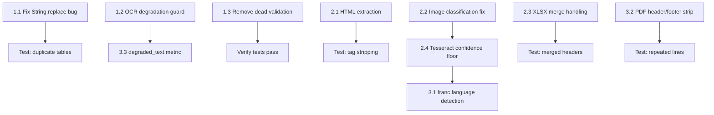

<!-- 68be2edf-31bc-4da5-bbbf-5b6461d77311 -->
---
todos:
  - id: "fix-string-replace"
    content: "Phase 1.1: Fix PDF table String.replace nondeterminism in pdfTableExtractor.ts:289 — switch to line-splice approach"
    status: pending
  - id: "ocr-degradation-guard"
    content: "Phase 1.2: Add confidence-floor check in documentPipeline.service.ts to prevent silent OCR degradation from marking ready"
    status: pending
  - id: "remove-dead-validation"
    content: "Phase 1.3: Remove dead validateContentExtraction method from fileValidator.service.ts"
    status: pending
  - id: "html-extraction"
    content: "Phase 2.1: Add HTML tag stripping in extraction dispatch using cheerio (already installed)"
    status: pending
  - id: "image-classification-fix"
    content: "Phase 2.2: Stop skipping OCR for photo-classified images in extractionDispatch.service.ts:346"
    status: pending
  - id: "xlsx-merge-handling"
    content: "Phase 2.3: Propagate XLSX merged cell values from sheet['!merges'] before sheet_to_json"
    status: pending
  - id: "tesseract-confidence-floor"
    content: "Phase 2.4: Add MIN_TESSERACT_CONFIDENCE threshold in extractionDispatch.service.ts:287"
    status: pending
  - id: "franc-language-detection"
    content: "Phase 3.1: Wire franc (already installed) into detectTesseractLangs for OCR language selection"
    status: pending
  - id: "pdf-header-footer-strip"
    content: "Phase 3.2: Add repeated header/footer stripping in pdfExtractor.service.ts after per-page extraction"
    status: pending
  - id: "degraded-text-metric"
    content: "Phase 3.3: Add degraded_text_rate counter to pipelineMetrics.service.ts"
    status: pending
isProject: false
---

# Ingestion Pipeline Remediation Plan

## Audit Findings Summary

All evidence gathered from: extraction services, pipeline orchestration, file validator, Prisma schema, dependency manifest, commit history, test suites (260 test files), DocumentStateManager state machine, and existing HTML-stripping patterns.

### Key Constraints Discovered

- **Prisma `DocumentStatus` enum** (`schema.prisma:1183-1193`) has NO `degraded` value. Available values: `uploading`, `uploaded`, `available`, `enriching`, `indexed`, `ready`, `failed`, `skipped`, `completed`. Adding one requires a migration.
- **`cheerio` (v1.1.2) is already installed** but unused in extraction. Can be leveraged for HTML stripping without new deps.
- **`franc` (v6.2.0) is already installed** but unused. Can be leveraged for language detection without new deps.
- **Outlook already has `stripHtml()`** at `graphClient.service.ts:71-81` — this pattern can be extracted into a shared utility.
- **`spreadsheetModel.semanticIndex.ts:402-424`** already reads `sheet.grid.merges` — the merge-handling pattern exists in the editing layer but NOT in the ingestion extractor.
- **`validateContentExtraction`** is only defined inside `fileValidator.service.ts:326` — zero callers anywhere in the codebase (confirmed via grep). It is dead code.
- **No `markDegraded` method** exists on `DocumentStateManager`. The state machine only allows transitions: `enriching -> {indexed, skipped, ready, failed, uploaded}`.

---

## Phase 1: Correctness Bugs (P0 risk, immediate)

### Task 1.1 — Fix PDF table `String.replace` nondeterminism

**Finding:** `pdfTableExtractor.ts:289` uses `resultText.replace(originalText, markdownBlock)` which replaces only the first match. If two table regions have identical raw text, the second is left raw while the first gets double-replaced.

**Root cause:** `String.prototype.replace` with a string (not regex) only replaces the first occurrence.

**File:** `backend/src/utils/pdfTableExtractor.ts`

**Fix:** Replace the reverse-iteration `String.replace` loop (lines 282-290) with offset-based splicing. The tables already have `startLine`/`endLine`. Convert those to character offsets and use `resultText.slice(0, startOffset) + markdownBlock + resultText.slice(endOffset)`.

```typescript
// Replace lines 278-296 with:
const resultLines = text.split("\n");
for (let i = tables.length - 1; i >= 0; i--) {
  const table = tables[i];
  const mdLines = table.markdown.split("\n");
  resultLines.splice(
    table.startLine,
    table.endLine - table.startLine + 1,
    "", ...mdLines,
  );
}
return { text: resultLines.join("\n"), tables, tableCount: tables.length };
```

**Validation test:** New test case in `pdfTableExtractor.test.ts` — feed two identical table blocks separated by prose, assert both get replaced with markdown.

**Rollback:** Revert the single function. No schema changes. No downstream deps.

**Effort:** ~1 hour.

---

### Task 1.2 — Prevent silent OCR degradation from marking "ready"

**Finding:** When PDF OCR fails and native text is weak, `pdfExtractor.service.ts:806-829` returns `confidence: 0.3` but the pipeline still chunks, embeds, and marks `ready`. Users get garbage search results.

**Root cause:** `documentPipeline.service.ts` has no confidence-floor check after extraction.

**Constraint:** No `degraded` Prisma status exists. We must use `skipped` with a descriptive reason rather than adding a new enum value + migration.

**Files:**
- `backend/src/services/ingestion/pipeline/documentPipeline.service.ts` (add check after extraction)
- `backend/src/services/ingestion/pipeline/pipelineMetrics.service.ts` (add degraded_text counter)

**Fix:** After line 215 in `documentPipeline.service.ts`, add:

```typescript
const MIN_USABLE_CONFIDENCE = 0.4;
if (
  extraction.confidence !== undefined &&
  extraction.confidence < MIN_USABLE_CONFIDENCE &&
  !extraction.ocrApplied
) {
  extraction.extractionWarnings = [
    ...(extraction.extractionWarnings || []),
    `confidence_below_threshold:${extraction.confidence}`,
  ];
}
```

And in the existing `fullText.trim().length < 10` block, also check for `confidence < MIN_USABLE_CONFIDENCE` when combined with `textQuality === "low"` to trigger the skip path with reason `LOW_CONFIDENCE_TEXT`.

**Validation test:** In the existing `documentIngestionPipeline.service.test.ts`, add a case where `processDocumentAsync` returns `confidence: 0.3, textQuality: "low"` and assert `markSkipped` is called (not `markIndexed`).

**Rollback:** Remove the confidence check. No schema changes.

**Effort:** ~2 hours.

---

### Task 1.3 — Wire or remove dead `validateContentExtraction`

**Finding:** `fileValidator.service.ts:326-394` is dead code — zero callers.

**Root cause:** The method was added during an early validation refactor (`778b16f0`) but never wired into the pipeline.

**Decision:** REMOVE the dead code. The extraction pipeline already handles empty text, low confidence, and corruption errors with richer logic than this method provides. Keeping it creates a false sense of coverage.

**Files:**
- `backend/src/services/ingestion/fileValidator.service.ts` — delete `validateContentExtraction` method (lines 326-394) and the `mammoth`/`XLSX` imports that are only used there.

**Validation:** Verify all existing tests pass. The method is never called, so no callers break.

**Rollback:** Re-add the method.

**Effort:** ~30 minutes.

---

## Phase 2: Critical Capability Gaps (high impact)

### Task 2.1 — Add HTML tag stripping in extraction dispatch

**Finding:** `extractionDispatch.service.ts:242-251` treats `text/html` the same as `text/plain` — raw HTML tags become indexed text.

**Root cause:** No HTML extractor exists. Gmail (`gmailSync.service.ts:80-84`) and Outlook (`graphClient.service.ts:71-81`) have their own inline stripping, but the extraction dispatch doesn't.

**Existing asset:** `cheerio` v1.1.2 is installed but unused.

**Files:**
- Create a shared utility: `backend/src/utils/htmlTextExtractor.ts` (extract the Outlook `stripHtml` pattern and enhance with `cheerio` for robust tag removal)
- `backend/src/services/ingestion/extraction/extractionDispatch.service.ts` — add `text/html` branch before the `text/` fallback

**Fix:**

```typescript
// In extractionDispatch.service.ts, before line 242:
if (mimeType === "text/html" || mimeType === "text/htm") {
  extractor = "html";
  const raw = buffer.toString("utf-8");
  const text = stripHtmlToText(raw); // new shared utility
  return { sourceType: "text", text, wordCount: text.split(/\s+/).length, confidence: 1.0 };
}
```

The shared `stripHtmlToText` uses cheerio: `cheerio.load(html)('script,style,noscript').remove(); return root.text().replace(/\s+/g, ' ').trim();`

**Validation test:** Unit test: feed `<html><style>...</style><body><p>Hello</p></body></html>`, assert output is `Hello`.

**Rollback:** Remove the branch; HTML falls back to raw text (current behavior).

**Effort:** ~1.5 hours.

---

### Task 2.2 — Improve image content classification to not skip document photos

**Finding:** `extractionDispatch.service.ts:125-151` classifies 4000x3000+ landscape images as "photo" and skips OCR. A phone photo of a document (very common) hits this path.

**Root cause:** Classification is purely dimension-based with no text-content signal.

**Files:**
- `backend/src/services/ingestion/extraction/extractionDispatch.service.ts`

**Fix:** Remove the `"photo"` classification from the OCR skip path. Only skip for `"icon"`. The `"photo"` case should fall through to OCR — if the image truly has no text, Google Vision/Tesseract will return empty text and it'll be marked visual-only. This is safe because the circuit breakers protect against OCR overload.

Specifically, change line 346:

```typescript
// Before:
if (imageType === "icon" || imageType === "photo") {
// After:
if (imageType === "icon") {
```

**Validation test:** Update `extractionDispatch.fallback.test.ts` — the test at line 150 that mocks `{ width: 4032, height: 3024 }` should now expect OCR to run (not skip).

**Rollback:** Re-add `|| imageType === "photo"`.

**Effort:** ~1 hour (including test updates).

---

### Task 2.3 — Handle XLSX merged cells in extraction

**Finding:** `xlsxExtractor.service.ts` never reads `sheet["!merges"]`. Merged header cells produce empty strings in non-origin positions.

**Existing pattern:** `spreadsheetModel.semanticIndex.ts:402-424` already reads `sheet.grid.merges` in the editing layer.

**Files:**
- `backend/src/services/extraction/xlsxExtractor.service.ts`

**Fix:** After line 466 (`XLSX.read`), add a post-processing step:

```typescript
// After reading, propagate merged cell values
const merges = sheet["!merges"] || [];
for (const merge of merges) {
  const originCell = XLSX.utils.encode_cell({ r: merge.s.r, c: merge.s.c });
  const originValue = sheet[originCell]?.v;
  if (originValue === undefined) continue;
  for (let r = merge.s.r; r <= merge.e.r; r++) {
    for (let c = merge.s.c; c <= merge.e.c; c++) {
      if (r === merge.s.r && c === merge.s.c) continue;
      const targetCell = XLSX.utils.encode_cell({ r, c });
      if (!sheet[targetCell]) sheet[targetCell] = { t: "s", v: originValue };
    }
  }
}
```

This runs before `sheet_to_json`, so the propagated values are visible to the existing `processSheet` logic.

**Validation test:** New test in `xlsxExtractor.service.test.ts` — build workbook with merged header "Q1 2024" spanning B1:D1, assert all columns under it have `colHeader: "Q1 2024"`.

**Rollback:** Remove the merge propagation loop. No schema changes.

**Effort:** ~2 hours.

---

### Task 2.4 — Add Tesseract confidence floor

**Finding:** `extractionDispatch.service.ts:281-303` accepts any Tesseract output with `textLength > 0`, regardless of confidence. Garbled text at confidence 0.05 is indexed.

**File:** `backend/src/services/ingestion/extraction/extractionDispatch.service.ts`

**Fix:** Inside `runTesseractFallback`, after line 287, add:

```typescript
const MIN_TESSERACT_CONFIDENCE = 0.25;
if (textLength > 0 && fallbackResult.confidence < MIN_TESSERACT_CONFIDENCE) {
  tesseractBreaker.recordFailure();
  recordOcrUsage("tesseract", false);
  recordOcrWaste(textLength);
  logger.warn("[OCR] Tesseract output below confidence floor", {
    filename, confidence: fallbackResult.confidence, textLength,
  });
  return toVisualOnly(
    `Image saved as visual-only (${fallbackReason}; tesseract confidence ${fallbackResult.confidence} < ${MIN_TESSERACT_CONFIDENCE})`,
  );
}
```

**Validation test:** In `extractionDispatch.fallback.test.ts`, add case where Tesseract returns `{ text: "garbage", confidence: 0.1 }` and assert result is `skipped: true`.

**Rollback:** Remove the confidence check.

**Effort:** ~45 minutes.

---

## Phase 3: Moderate Gaps (lower risk, meaningful quality improvement)

### Task 3.1 — Wire `franc` for Tesseract language detection

**Finding:** `detectTesseractLangs` (line 180-187) is hardcoded `eng+por` with brittle filename heuristics. `franc` v6.2.0 is installed but unused.

**Constraint:** `franc` requires a text sample. For image OCR, we don't have text yet. But for PDF selective OCR, we have native text. Use `franc` on native text to pick Tesseract langs when falling back.

**Files:**
- `backend/src/services/ingestion/extraction/extractionDispatch.service.ts` — enhance `detectTesseractLangs` to accept optional text sample
- No new deps needed

**Fix:**

```typescript
import { franc } from "franc";

function detectTesseractLangs(filename?: string, textSample?: string): string {
  if (textSample && textSample.length > 50) {
    const detected = franc(textSample);
    if (detected === "spa") return "eng+spa";
    if (detected === "por") return "eng+por";
    if (detected === "fra") return "eng+fra";
    // Default: include both for safety
    return "eng+por+spa";
  }
  // Existing filename heuristics as fallback
  ...
}
```

**Validation test:** Unit test: pass Portuguese text sample, assert `eng+por`. Pass Spanish, assert `eng+spa`.

**Rollback:** Revert to hardcoded langs.

**Effort:** ~1 hour.

---

### Task 3.2 — Add PDF header/footer stripping

**Finding:** Repeated boilerplate (page numbers, company names, confidentiality notices) appears in every page chunk.

**Files:**
- `backend/src/services/extraction/pdfExtractor.service.ts`

**Fix:** After building `enhancedPages` (line 638), add a post-processing pass:

```typescript
function stripRepeatedHeadersFooters(pages: PdfExtractedPage[]): PdfExtractedPage[] {
  if (pages.length < 4) return pages; // need enough pages to detect repetition
  const firstLines = pages.map(p => p.text.split("\n")[0]?.trim()).filter(Boolean);
  const lastLines = pages.map(p => { const l = p.text.split("\n"); return l[l.length-1]?.trim(); }).filter(Boolean);
  
  const freq = (lines: string[]) => {
    const counts = new Map<string, number>();
    for (const l of lines) counts.set(l, (counts.get(l) || 0) + 1);
    return counts;
  };
  
  const threshold = Math.ceil(pages.length * 0.6);
  const headerFreq = freq(firstLines);
  const footerFreq = freq(lastLines);
  const repeatedHeaders = new Set([...headerFreq].filter(([,c]) => c >= threshold).map(([l]) => l));
  const repeatedFooters = new Set([...footerFreq].filter(([,c]) => c >= threshold).map(([l]) => l));
  
  return pages.map(p => {
    let lines = p.text.split("\n");
    if (lines.length > 0 && repeatedHeaders.has(lines[0]?.trim())) lines = lines.slice(1);
    if (lines.length > 0 && repeatedFooters.has(lines[lines.length-1]?.trim())) lines = lines.slice(0, -1);
    return { ...p, text: lines.join("\n").trim() };
  });
}
```

**Validation test:** Build a multi-page text array where every page starts with "CONFIDENTIAL" and ends with "Page N of 10". Assert those lines are stripped.

**Rollback:** Remove the function call. Pages revert to unstripped.

**Effort:** ~2 hours.

---

### Task 3.3 — Add `degraded_text_rate` telemetry metric

**Finding:** No visibility into how many documents are silently indexed with low-quality text.

**Files:**
- `backend/src/services/ingestion/pipeline/pipelineMetrics.service.ts`

**Fix:** Add counter `degradedTextCount` alongside existing `emptyTextCount`. Record in `documentPipeline.service.ts` when `confidence < 0.5` but text exists. Expose in `getMetricsSummary()`.

**Effort:** ~30 minutes.

---

## Dependency Graph



Tasks within the same phase can be parallelized. Cross-phase dependencies are shown above.

## Acceptance Criteria

- All 260 existing tests pass after each task
- Each task has at least one new test proving the fix
- No new npm dependencies added (cheerio, franc already installed)
- No Prisma schema migration required
- No breaking changes to the `DispatchedExtractionResult` union type
- Pipeline ingestion of PDF, DOCX, XLSX, PPTX continues to work end-to-end
- Audit re-score target: 75+ (from 63)
