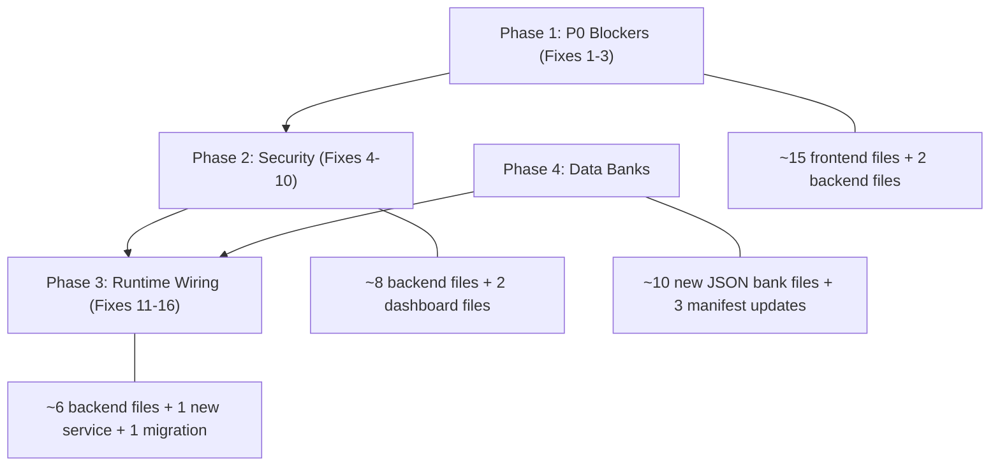

<!-- 44f6fbc2-08be-4ad5-b7ba-c66ceee99773 -->
---
todos:
  - id: "p0-fix1-url-tokens"
    content: "Fix 1: Remove AUTH_URL_TOKEN_COMPAT — delete query-string token redirect in auth.routes.ts and localStorage write in OAuthCallback.jsx"
    status: pending
  - id: "p0-fix2-encryption-pw"
    content: "Fix 2: Remove encryptionPassword from localStorage in presignedUploadService.js — thread as function parameter"
    status: pending
  - id: "p0-fix3-localstorage-compat"
    content: "Fix 3: Remove AUTH_LOCALSTORAGE_COMPAT from authService.js and all ~15 consumer files reading localStorage tokens"
    status: pending
  - id: "sec-fix4-admin-cookies"
    content: "Fix 4: Migrate admin dashboard AuthContext.tsx to httpOnly cookies (new adminAuthCookies.ts + update client.ts)"
    status: pending
  - id: "sec-fix5-apple-oauth"
    content: "Fix 5: Add HMAC-signed state/nonce to Apple OAuth in auth.routes.ts using oauthStateNonceStore pattern"
    status: pending
  - id: "sec-fix6-postmessage"
    content: "Fix 6: Replace postMessage('*') with config.FRONTEND_URL in integrations.controller.ts"
    status: pending
  - id: "sec-fix7-pepper"
    content: "Fix 7: Create backend/src/config/secrets.ts and consolidate REFRESH_TOKEN_PEPPER from 3 files"
    status: pending
  - id: "sec-fix8-csp"
    content: "Fix 8: Remove production-only guard on CSP in app.ts — apply in all environments"
    status: pending
  - id: "sec-fix9-nonce-csp"
    content: "Fix 9: Replace unsafe-inline with nonce-based script-src in integrations.controller.ts popup"
    status: pending
  - id: "sec-fix10-dev-logging"
    content: "Fix 10: Change dev verification code logging guard from !== production to === development in authBridge.ts"
    status: pending
  - id: "rt-fix11-connector-doctype"
    content: "Fix 11: Add doc-type classification to connectorsIngestion.service.ts instead of hardcoding text/plain"
    status: pending
  - id: "rt-fix12-sync-cursors"
    content: "Fix 12: Add syncCursor column to ConnectorIdentityMap + persist/load cursors in connectorHandler.service.ts"
    status: pending
  - id: "rt-fix13-duplicate-block"
    content: "Fix 13: Make duplicate content hash detection block ingestion in documentIngestionPipeline.service.ts"
    status: pending
  - id: "rt-fix14-collision-guard"
    content: "Fix 14: Add reverse-collision CLARIFY guard in turnRouter.service.ts for connector queries falling to KNOWLEDGE"
    status: pending
  - id: "rt-fix15-circuit-breaker"
    content: "Fix 15: Add per-provider circuit breaker to connector-worker.ts"
    status: pending
  - id: "rt-fix16-connector-metrics"
    content: "Fix 16: Create connectorMetrics.service.ts with per-provider ring buffers for sync/search/send telemetry"
    status: pending
  - id: "banks-doc-types"
    content: "Create connector doc type banks: doc_type_catalog, section schemas, entity patterns"
    status: pending
  - id: "banks-operational"
    content: "Create operational banks: connector_sync_metrics, connector_routing_collision_traps, connector_failure_codes"
    status: pending
  - id: "banks-registration"
    content: "Register all new banks in bank_registry, bank_checksums, and bank_dependencies manifests"
    status: pending
isProject: false
---
# Integrations & Connectors Audit — Fix Plan

All 10 security issues and all runtime wiring gaps are **confirmed present** in the codebase. This plan is organized into 4 phases: P0 security blockers first, then remaining security, then runtime wiring, then data banks.

---

## Phase 1: P0 Security Blockers (CRITICAL — ship-blocking)

### Fix 1: Remove AUTH_URL_TOKEN_COMPAT (tokens in URL)

**Files:**
- `backend/src/entrypoints/http/routes/auth.routes.ts` (lines 50, 137-147)
- `frontend/src/components/auth/OAuthCallback.jsx` (lines 45-51)

**Changes:**
- Delete the `AUTH_URL_TOKEN_COMPAT` constant and the entire `if (AUTH_URL_TOKEN_COMPAT)` block in `auth.routes.ts:137-147` that builds query-string redirect with `accessToken` and `refreshToken`. The `setAuthCookies()` call at line 136 already handles auth via httpOnly cookies.
- In `OAuthCallback.jsx`, delete the compat block at lines 45-51 that reads tokens from `searchParams` and writes to `localStorage`. The cookie-based flow is the default.

### Fix 2: Remove encryptionPassword from localStorage

**Files:**
- `frontend/src/services/presignedUploadService.js` (lines 393-396)

**Changes:**
- Remove `localStorage.getItem('encryptionPassword')` and `localStorage.getItem('encryptionEnabled')` reads.
- Add `encryptionPassword` as an optional parameter to the upload function (matching the pattern in `UploadHub.impl.js:255` which gets it from `useAuth()`).
- Find all callers of `presignedUploadService` and pass `encryptionPassword` from context. If no callers exist (service may be deprecated in favor of `unifiedUploadService`), mark the file as deprecated and remove the localStorage reads.
- Search for and remove any `localStorage.setItem('encryptionPassword', ...)` calls across the frontend.

### Fix 3: Remove AUTH_LOCALSTORAGE_COMPAT token storage

**Files (backend):**
- `frontend/src/services/authService.js` (lines 39-41, 94-96, 128-130, 152-154) — delete all `if (AUTH_LOCALSTORAGE_COMPAT) localStorage.setItem(...)` blocks

**Files (consumers) — delete `getCompatAccessToken` / `localStorage.getItem('accessToken')` reads:**
- `frontend/src/services/chatService.js` (lines 6, 21, 90)
- `frontend/src/services/documentService.js` (lines 3, 6)
- `frontend/src/services/downloadService.js` (lines 9, 15)
- `frontend/src/components/documents/DocumentViewer.impl.js` (lines 68-72)
- `frontend/src/utils/security/auth.js` (lines 10-12)
- `frontend/src/components/auth/OAuthCallback.jsx` (covered in Fix 1)
- Additional files: `api.js`, `DocumentsContext.impl.js`, `AuthContext.impl.js`, `NotificationCenter.impl.js`, `CategoryDetail.impl.js`, `GeneratedDocumentCard.impl.js`, `DocumentThumbnail.impl.js`, `useChatEndpoints.js`, `Verification.impl.js`

**Strategy:** All API calls already use `credentials: 'include'` with httpOnly cookies (`koda_at`, `koda_rt`). The localStorage path is pure compat. Remove every `AUTH_LOCALSTORAGE_COMPAT` reference and `getCompatAccessToken` helper. The cookie-based auth is the sole path.

---

## Phase 2: Remaining Security Fixes (HIGH/MEDIUM/LOW)

### Fix 4: Migrate admin dashboard to httpOnly cookies

**Files:**
- `dashboard/client/src/contexts/AuthContext.tsx` (lines 113-117)
- `dashboard/client/src/api/client.ts`

**Changes:**
- Remove `localStorage.setItem("auth_token", ...)`, `localStorage.setItem("refresh_token", ...)`, `localStorage.setItem("auth_admin", ...)`.
- Create a parallel admin auth cookie flow in the backend (e.g. `backend/src/utils/adminAuthCookies.ts`) mirroring `authCookies.ts` with cookie names like `koda_admin_at`, `koda_admin_rt`.
- Update `dashboard/client/src/api/client.ts` to use `credentials: 'include'` instead of reading tokens from localStorage for the Authorization header.
- Update admin login/logout endpoints to set/clear these cookies.

### Fix 5: Add state parameter to Apple OAuth

**Files:**
- `backend/src/entrypoints/http/routes/auth.routes.ts` (lines 546-556)
- `backend/src/services/connectors/oauthStateNonceStore.service.ts`

**Changes:**
- Extend `ProviderKey` type to include `"apple"`.
- In the Apple authorize endpoint, generate an HMAC-signed nonce using crypto, store it via `markOAuthStateNonceUsed("apple", nonce, ...)`, and add it as the `state` parameter in the Apple authorize URL.
- In the `/apple/callback` handler, validate the returned `state` against the nonce store and reject if invalid or replayed.

### Fix 6: Fix postMessage wildcard origin

**File:** `backend/src/controllers/integrations.controller.ts` (line 133)

**Change:** Replace `'*'` with the actual frontend URL:

```javascript
window.opener.postMessage({ type: 'koda_oauth_done', ... }, '${config.FRONTEND_URL}');
```

`config.FRONTEND_URL` is already available via `backend/src/config/env.ts`.

### Fix 7: Consolidate REFRESH_TOKEN_PEPPER

**New file:** `backend/src/config/secrets.ts`

**Changes:**
- Create `secrets.ts` exporting `REFRESH_TOKEN_PEPPER`:
  ```typescript
  export const REFRESH_TOKEN_PEPPER =
    process.env.KODA_REFRESH_PEPPER || process.env.JWT_REFRESH_SECRET || "";
  ```
- Update imports in `auth.service.ts` (line 13), `auth.routes.ts` (line 48), `authBridge.ts` (line 33) to use the shared constant.

### Fix 8: Apply CSP in all environments

**File:** `backend/src/app.ts` (line 128)

**Change:** Remove the `if (process.env.NODE_ENV === "production")` guard. Apply Helmet CSP unconditionally. For development, add a slightly relaxed directive set if needed (e.g. allow `localhost` in `connectSrc`), but CSP itself must always be active.

### Fix 9: Nonce-based script for OAuth popup

**File:** `backend/src/controllers/integrations.controller.ts` (lines 156-174)

**Change:** In `sendOauthHtml`, generate a random nonce:
```typescript
const nonce = crypto.randomBytes(16).toString("base64");
```
Replace `'unsafe-inline'` in `script-src` with `'nonce-${nonce}'` and add `nonce="${nonce}"` to the inline `<script>` tag in the HTML response.

### Fix 10: Gate dev verification code logging

**File:** `backend/src/bootstrap/authBridge.ts` (lines 104-109)

**Change:** Replace `process.env.NODE_ENV !== "production"` with `process.env.NODE_ENV === "development"` so staging environments don't leak verification codes.

---

## Phase 3: Runtime Wiring Fixes

### Fix 11: Connector doc-type classification in ingestion

**File:** `backend/src/services/connectors/connectorsIngestion.service.ts` (lines 91, 102, 154)

**Changes:**
- Instead of hardcoding `mimeType: "text/plain"`, determine the actual mimeType from the connector payload (emails are `message/rfc822` or `text/html`, Slack messages are `application/json`).
- Before chunking, call the doc-type classification pipeline (the same one used by `documentPipeline.service.ts`) to classify connector-sourced content into the new connector doc types (see Phase 4).
- Pass the classified doc type downstream so section detection works.

### Fix 12: Persist incremental sync cursors

**Files:**
- `backend/prisma/schema.prisma` — add `syncCursor String?` and `lastSyncAt DateTime?` to `ConnectorIdentityMap`
- `backend/src/services/core/handlers/connectorHandler.service.ts` (line 381)
- `backend/src/services/connectors/connectorIdentityMap.service.ts`

**Changes:**
- Add a Prisma migration for the new columns on `connector_identity_maps`.
- In `connectorIdentityMap.service.ts`, add `getSyncCursor(userId, provider)` and `updateSyncCursor(userId, provider, cursor)`.
- In `connectorHandler.service.ts`, load the cursor before enqueuing: replace `cursor: null` with the stored cursor.
- After successful sync, persist the new cursor returned by the provider.

### Fix 13: Duplicate content detection — block instead of log

**File:** `backend/src/queues/workers/documentIngestionPipeline.service.ts` (lines 210-231)

**Change:** After detecting a duplicate, return early with `{ skipped: true, reason: "duplicate_content", existingDocumentId: duplicate.id }` instead of continuing ingestion. Update the document status to indicate it was a duplicate and link to the existing doc.

### Fix 14: Reverse-collision guard in turnRouter

**File:** `backend/src/services/chat/turnRouter.service.ts` (around lines 1057-1073)

**Changes:**
- Before the final fallthrough to KNOWLEDGE/GENERAL, check if the user has any connected providers (from `connectorContext`).
- If a provider is connected AND the query contains provider-specific keywords (e.g. "gmail", "email", "outlook", "slack", "inbox") but the routing banks didn't match, return `{ route: "CLARIFY" }` with a prompt asking the user to clarify whether they meant to search their connected provider.
- Add the keyword matching as a lightweight regex check, not a full bank evaluation.

### Fix 15: Add circuit breaker to connector-worker

**File:** `backend/src/workers/connector-worker.ts` (lines 42-73)

**Changes:**
- Implement a per-provider circuit breaker (simple state machine: CLOSED -> OPEN -> HALF_OPEN).
- Track consecutive failures per provider. After N consecutive failures (e.g. 5), open the circuit for a cooldown period (e.g. 5 minutes).
- When circuit is OPEN, reject jobs immediately with a descriptive error instead of burning retries.
- On HALF_OPEN, allow one test request through; if it succeeds, close the circuit.

### Fix 16: Per-connector metrics service

**New file:** `backend/src/services/connectors/connectorMetrics.service.ts`

**Changes:**
- Create a metrics service with per-provider ring buffers tracking: sync latency, search latency, send latency, error rates, token refresh counts, items synced.
- Mirror the ring-buffer pattern from `pipelineMetrics.service.ts`.
- Instrument `connector-worker.ts`, `connectorHandler.service.ts`, and individual provider sync services to emit metrics.

---

## Phase 4: Missing Data Banks

### New bank files to create under `backend/src/data_banks/`:

**connector_doc_types** — `document_intelligence/domains/connectors/doc_types/doc_type_catalog.any.json`
- Doc types: `email_message`, `email_thread`, `slack_message`, `slack_thread`
- Follow the banking catalog format: `id`, `name` (en/pt), `description`, `detectionPatterns`, `priority`

**connector_section_schemas** — `document_intelligence/domains/connectors/doc_types/sections/`
- `connector_email_message.sections.any.json` — sections: headers, body, signature, attachments
- `connector_email_thread.sections.any.json` — sections: thread_summary, messages, participants
- `connector_slack_message.sections.any.json` — sections: message, reactions, thread_replies
- `connector_slack_thread.sections.any.json` — sections: thread_summary, messages, participants

**connector_entity_patterns** — `document_intelligence/domains/connectors/entity_patterns.any.json`
- Entity patterns for: sender, recipients, date, message-ID, subject, channel-name

**connector_sync_metrics** — `connectors/connector_sync_metrics.any.json`
- Telemetry definitions: fetch_count, ingest_count, latency_ms, error_count, last_sync_at per provider

**connector_routing_collision_traps** — `routing/connector_routing_collision_traps.any.json`
- Adversarial QA test cases where connector queries must NOT route to KNOWLEDGE (e.g. "search my Gmail for invoice", "find the email from John", "check my Slack messages")

**connector_failure_codes** — `connectors/connector_failure_codes.any.json`
- Structured failure taxonomy: auth_expired, rate_limited, quota_exceeded, provider_down, invalid_cursor, permission_denied

After creating banks, register them in:
- `backend/src/data_banks/manifest/bank_registry.any.json`
- `backend/src/data_banks/manifest/bank_checksums.any.json`
- `backend/src/data_banks/manifest/bank_dependencies.any.json`

---

## Execution Order



Phase 4 (data banks) can be done in parallel with Phase 2 since they have no code dependencies until Phase 3 wires them in.
