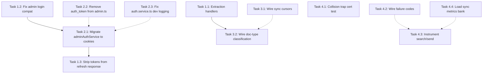

<!-- 44f6fbc2-08be-4ad5-b7ba-c66ceee99773 -->
---
todos:
  - id: "t1-1-extraction-handlers"
    content: "Task 1.1: Add extraction handlers for message/rfc822 and application/x-slack-message in extractionDispatch.service.ts"
    status: pending
  - id: "t1-2-admin-login-compat"
    content: "Task 1.2: Restore tokens in admin login response + fix refresh cookie bug (result.tokens.accessToken)"
    status: pending
  - id: "t2-1-admin-auth-cookie-migration"
    content: "Task 2.1: Migrate adminAuthService.js + adminApi.js + AdminAuthContext.jsx to cookie-first (remove localStorage tokens)"
    status: pending
  - id: "t1-3-strip-refresh-tokens"
    content: "Task 1.3: Strip tokens from admin refresh response body (depends on 2.1)"
    status: pending
  - id: "t2-2-remove-auth-token-admin-ts"
    content: "Task 2.2: Remove auth_token localStorage read from dashboard/client/src/api/admin.ts"
    status: pending
  - id: "t2-3-auth-service-dev-logging"
    content: "Task 2.3: Change 4 instances of NODE_ENV !== production to === development in auth.service.ts"
    status: pending
  - id: "t3-1-sync-cursor-wiring"
    content: "Task 3.1: Wire sync cursors end-to-end (create CIM rows on OAuth, bridge file cursors to DB in worker)"
    status: pending
  - id: "t3-2-doctype-pipeline-wiring"
    content: "Task 3.2: Wire doc-type classification through pipeline (add connectorDocType to job data, skip tagger, add connectors domain)"
    status: pending
  - id: "t4-1-collision-trap-test"
    content: "Task 4.1: Create connector-routing-collision-traps.cert.test.ts exercising all 10 traps"
    status: pending
  - id: "t4-2-failure-codes-wiring"
    content: "Task 4.2: Wire failure codes into circuit breaker (classify errors, use retryable flag)"
    status: pending
  - id: "t4-3-search-send-instrumentation"
    content: "Task 4.3: Instrument searchLiveProvider and handleSend with recordSearchLatency/recordSendLatency"
    status: pending
  - id: "t4-4-sync-metrics-bank-load"
    content: "Task 4.4: Load connector_sync_metrics bank config into connectorMetrics.service.ts"
    status: pending
isProject: false
---
# Integrations Gaps Remediation Plan

All findings are cross-referenced against the codebase investigation. This plan addresses 20 discrete issues organized into 4 phases by risk.

---

## Audit Findings Summary

### Critical (ship-blocking)

- **FIND-1:** Connector MIME types `message/rfc822` and `application/x-slack-message` are not supported by `extractionDispatch.service.ts`. Connector documents entering the queue pipeline **crash at extraction** (line 490 throws).
- **FIND-2:** Admin login is **broken** in the main frontend. Backend no longer returns `tokens` in JSON body (we removed it in Fix 4), but `frontend/src/services/adminAuthService.js:16-18` destructures `json.data.tokens.accessToken` which throws `TypeError`.
- **FIND-3:** Admin refresh endpoint has a structural bug: checks `result.accessToken` (undefined) when the actual shape is `result.tokens.accessToken`, so `setAdminAuthCookies` is never called on refresh.

### High

- **FIND-4:** `adminAuthService.js` stores `adminAccessToken`/`adminRefreshToken` in localStorage (lines 17-18, 37-38). Actively used by `AdminAuthContext.jsx`, `AdminLayout.jsx`, `AdminLogin.jsx`, `adminApi.js`.
- **FIND-5:** Admin refresh endpoint returns tokens in JSON body (`res.json({ ok: true, data: result })`), which is `{ tokens: { accessToken, refreshToken } }`.

### Medium

- **FIND-6:** `dashboard/client/src/api/admin.ts:63` reads stale `auth_token` from localStorage (dead code since AuthContext no longer sets it).
- **FIND-7:** `auth.service.ts` uses `!== "production"` in 4 places (lines 168, 241, 282, 496) for verification code logging instead of `=== "development"`.
- **FIND-8:** Sync cursor chain is broken at 5 points: worker doesn't pass cursor to sync services, `updateSyncCursor` never called, Gmail/Outlook have no ConnectorIdentityMap rows, cursor format mismatch.
- **FIND-9:** Doc-type classification overwritten by pipeline; `"connectors"` not in `DocumentIntelligenceDomain`; section schemas unreachable.
- **FIND-10:** `connector_routing_collision_traps` bank not exercised by any test.
- **FIND-11:** `connector_failure_codes` bank not consumed by worker or circuit breaker.
- **FIND-12:** `connector_sync_metrics` bank not consumed by metrics service.
- **FIND-13:** `recordSearchLatency`/`recordSendLatency` exist in `connectorMetrics.service.ts` but are never called.

---

## Phase 1: Critical Fixes (extraction crash + admin auth breakage)

### Task 1.1: Add extraction handlers for connector MIME types

**Finding:** FIND-1
**File:** `backend/src/services/ingestion/extraction/extractionDispatch.service.ts`
**Root cause:** The switch/map at line ~490 has no case for `message/rfc822` or `application/x-slack-message`. Connector docs that enter the pipeline queue crash.
**Fix:** Add two cases that treat these MIME types as plain text extraction (connector ingestion already stored the text content, so extraction just needs to read it back):

```typescript
case "message/rfc822":
case "application/x-slack-message":
  return extractPlainText(filePath, options);
```

**Validation:** Unit test with a mock `.eml` file; assert extraction returns text without throwing.
**Rollback:** Remove the two case entries.
**Effort:** ~15 min.

### Task 1.2: Fix admin auth login compatibility

**Finding:** FIND-2, FIND-4
**File:** `backend/src/entrypoints/http/routes/admin-auth.routes.ts` (login handler)
**Root cause:** We changed the login response to `{ ok: true, data: { admin } }` but `adminAuthService.js:16` destructures `data.tokens.accessToken`, causing a crash.
**Fix (two parts):**

1. **Backend** (`admin-auth.routes.ts`): Restore `tokens` in the login response alongside cookies. The response should be `{ ok: true, data: { admin: result.admin, tokens: result.tokens } }`. The cookies provide httpOnly security; the body maintains backward compat for the main frontend admin flow. (Removing body tokens requires migrating `adminAuthService.js` to cookie-first, which is Task 2.1.)

2. **Admin refresh** (`admin-auth.routes.ts`): Fix the cookie bug on refresh. Change `if (result.accessToken)` to `if (result.tokens?.accessToken)` and pass `result.tokens.accessToken, result.tokens.refreshToken` to `setAdminAuthCookies`.

**Validation:** Manual test: admin login via frontend, verify cookies are set AND response includes tokens. Admin refresh, verify cookies are updated.
**Rollback:** Revert the two line changes.
**Effort:** ~15 min.

### Task 1.3: Fix admin refresh tokens-in-body exposure

**Finding:** FIND-5
**File:** `backend/src/entrypoints/http/routes/admin-auth.routes.ts` (refresh handler)
**Root cause:** `res.json({ ok: true, data: result })` returns full token payload.
**Fix:** After setting cookies, strip tokens from the response: `res.json({ ok: true, data: { refreshed: true } })`. But this will break `adminAuthService.js:36-38` which reads `data.tokens`. So this must be paired with Task 2.1.
**Dependency:** Task 2.1 must complete first.

---

## Phase 2: Admin Auth Migration to Cookie-First (HIGH)

### Task 2.1: Migrate `adminAuthService.js` to cookie-first

**Finding:** FIND-4
**Files:**
- `frontend/src/services/adminAuthService.js` (primary)
- `frontend/src/services/adminApi.js` (reads token)
- `frontend/src/context/AdminAuthContext.jsx` (orchestrates)

**Root cause:** `adminAuthService.js` stores admin tokens in localStorage at 5 locations and reads them at 5 locations. `adminApi.js` reads the token for Authorization headers.

**Fix:**
1. In `adminAuthService.js`:
   - `login()`: Remove `localStorage.setItem('adminAccessToken', ...)` and `localStorage.setItem('adminRefreshToken', ...)`. Keep `adminUser` storage (non-sensitive metadata). Use `credentials: 'include'` on the fetch call so cookies are stored. Return `{ admin }` only.
   - `refresh()`: Remove localStorage token writes. Call the endpoint with `credentials: 'include'`. Backend will read refresh token from cookie.
   - `logout()`: Remove localStorage token reads/removes. Call endpoint with `credentials: 'include'`. Remove only `adminUser`.
   - `getAccessToken()`: Return `null` (cookies handle auth).
   - `isAuthenticated()`: Check `adminUser` presence only (cookie validity is server-side).
   - `getCurrentAdmin()`: Unchanged (reads `adminUser`, not a token).

2. In `adminApi.js`:
   - Remove `Authorization: Bearer ${token}` header construction.
   - Add `credentials: 'include'` to all fetch calls.

3. In `AdminAuthContext.jsx`:
   - Remove references to `getAccessToken()` for auth headers.

4. After migration, update admin refresh endpoint (Task 1.3) to stop returning tokens in body.

**Validation:** Admin login, navigate admin pages, refresh, logout. All should work with cookies only. Verify `localStorage` has no `adminAccessToken` or `adminRefreshToken`.
**Rollback:** Revert all 3 files.
**Effort:** ~45 min.

### Task 2.2: Remove `auth_token` from `dashboard/client/src/api/admin.ts`

**Finding:** FIND-6
**File:** `dashboard/client/src/api/admin.ts` (line 63)
**Fix:** Remove `localStorage.getItem("auth_token")` from `getAuthHeaders()`. Keep only `admin_key`.
**Effort:** ~5 min.

### Task 2.3: Fix `auth.service.ts` dev logging

**Finding:** FIND-7
**File:** `backend/src/services/auth.service.ts` (lines 168, 241, 282, 496)
**Fix:** Change all 4 instances of `process.env.NODE_ENV !== "production"` to `process.env.NODE_ENV === "development"`.
**Effort:** ~5 min.

---

## Phase 3: Sync Cursor + Doc-Type Pipeline Wiring (MEDIUM)

### Task 3.1: Wire sync cursors end-to-end

**Finding:** FIND-8
**Files:**
- `backend/src/workers/connector-worker.ts`
- `backend/src/services/connectors/connectorIdentityMap.service.ts`
- `backend/src/services/connectors/gmail/gmailSync.service.ts`
- `backend/src/services/connectors/outlook/outlookSync.service.ts`
- `backend/src/services/connectors/slack/slackSync.service.ts`
- `backend/src/services/connectors/gmail/gmailOAuth.service.ts`
- `backend/src/services/connectors/outlook/outlookOAuth.service.ts`

**Root cause (5 breaks):**
1. Worker does not pass `job.data.cursor` to sync service call
2. Worker never calls `updateSyncCursor` after sync
3. Sync services use file-based cursors, not input cursor
4. Gmail/Outlook OAuth flows don't create `ConnectorIdentityMap` rows
5. Cursor format mismatch (DB expects string, providers use JSON objects)

**Fix strategy:** Rather than rewriting all 3 sync services to accept external cursors (high risk, touches provider-specific logic), adopt a **bridge approach**:

1. **Create ConnectorIdentityMap rows on OAuth connect** for Gmail and Outlook (Slack already does this). In `gmailOAuth.service.ts` and `outlookOAuth.service.ts`, after successful token exchange, call `prisma.connectorIdentityMap.upsert()` with `provider`, `userId`, and `externalWorkspaceId` set to the user's email or tenant ID.

2. **Post-sync cursor persistence in the worker:** After `fn.call(syncService, ...)` succeeds, read the provider's file-based cursor (e.g. `storage/connectors/cursors/{userId}.json`) and call `updateSyncCursor(userId, provider, JSON.stringify(cursorData))`. This bridges file-based cursors into the DB without modifying sync service internals.

3. **Pre-sync cursor loading:** In the worker, before calling sync, if `job.data.cursor` is non-null, write it to the provider's file-based cursor path. This allows the DB cursor to seed the file-based cursor on fresh deployments.

**Validation:** Sync Gmail, verify `ConnectorIdentityMap` row has `syncCursor` populated. Force resync, verify cursor is loaded from DB.
**Rollback:** Remove the bridge reads/writes; sync services fall back to their own file-based cursors.
**Effort:** ~1.5 hours.

### Task 3.2: Wire doc-type classification through pipeline

**Finding:** FIND-9, FIND-1 (related)
**Files:**
- `backend/src/queues/queueConfig.ts` — `ProcessDocumentJobData`
- `backend/src/services/connectors/connectorsIngestion.service.ts`
- `backend/src/services/ingestion/pipeline/documentPipeline.service.ts`
- `backend/src/services/ingestion/extraction/extractionDispatch.service.ts`
- `backend/src/services/core/banks/documentIntelligenceBanks.service.ts`

**Root cause (chain of 5 breaks):** Classification set at ingestion gets overwritten; domain "connectors" not recognized; section schemas unreachable.

**Fix:**
1. Add `connectorDocType?: string` and `connectorDomain?: string` to `ProcessDocumentJobData` in `queueConfig.ts`.
2. In `connectorsIngestion.service.ts`, pass these fields through `enqueueOrIndexFallback`.
3. In `documentPipeline.service.ts`, at the `tagDocumentType` step: if `jobData.connectorDocType` is set, skip the tagger and use the pre-classified type.
4. Add `"connectors"` to the `DocumentIntelligenceDomain` union type in `documentIntelligenceBanks.service.ts`.
5. Task 1.1 already handles extraction for connector MIME types.

**Validation:** Ingest a Gmail email via the connector flow, verify `documentMetadata.classification` is `email_message` after pipeline completes (not overwritten).
**Rollback:** Remove the optional fields; pipeline reverts to always running tagger.
**Effort:** ~1 hour.

---

## Phase 4: Data Bank Wiring + Observability (MEDIUM-LOW)

### Task 4.1: Create collision trap certification test

**Finding:** FIND-10
**File:** New file `backend/src/tests/certification/connector-routing-collision-traps.cert.test.ts`

**Fix:** Create a cert test that:
1. Loads `connector_routing_collision_traps.any.json`
2. For each trap, builds a `TurnContext` with matching `connectors.connected` providers
3. Calls `turnRouter.decideWithIntent(ctx)` (or the route policy directly)
4. Asserts `result.route === trap.expectedRoute` and `result.route !== trap.forbiddenRoute`

Model after `routing-parity-behavioral.cert.test.ts` structure.

**Validation:** `npx jest connector-routing-collision-traps.cert.test.ts` passes.
**Effort:** ~45 min.

### Task 4.2: Wire failure codes into circuit breaker

**Finding:** FIND-11
**Files:**
- `backend/src/workers/connector-worker.ts`
- `backend/src/services/connectors/connectorMetrics.service.ts`

**Fix:**
1. Create a `classifyConnectorError(err: Error): string` function that maps error messages/status codes to failure codes from the bank (using regex patterns matching the bank's codes: `AUTH_EXPIRED`, `RATE_LIMITED`, `PROVIDER_DOWN`, etc.).
2. In the circuit breaker's `recordFailure`, accept the classified code. If `retryable: false` (from bank), open the circuit immediately instead of waiting for threshold.
3. Extend `recordSyncError` to accept an optional `failureCode` parameter.

**Validation:** Simulate a 429 error, verify it classifies as `RATE_LIMITED`. Simulate an auth error, verify circuit opens faster for non-retryable codes.
**Effort:** ~45 min.

### Task 4.3: Instrument search/send latency

**Finding:** FIND-13
**File:** `backend/src/services/core/handlers/connectorHandler.service.ts`

**Fix:** In `searchLiveProvider()` (line ~675) and `handleSend()` (line ~633), wrap the provider calls:

```typescript
const start = Date.now();
// ... existing provider call ...
recordSearchLatency(provider, Date.now() - start);
```

Same pattern for `handleSend` with `recordSendLatency`.

**Validation:** Execute a connector search, verify `getAllConnectorMetrics()` shows non-zero `searchAttempts` and `searchLatencyP50`.
**Effort:** ~20 min.

### Task 4.4: Load sync metrics bank config

**Finding:** FIND-12
**File:** `backend/src/services/connectors/connectorMetrics.service.ts`

**Fix:** At module init, attempt to load `connector_sync_metrics.any.json` and use its `config.ringBufferSize` instead of hardcoded `WINDOW_SIZE = 500`. Graceful fallback to 500 if bank not found.

**Effort:** ~15 min.

---

## Dependency Graph



**Legend:** Solid arrows = hard dependency. Dashed = soft/parallel.

---

## Effort Summary

| Phase | Tasks | Total Effort | Risk |
|-------|-------|-------------|------|
| Phase 1 | 1.1, 1.2, 1.3 | ~45 min | Critical: unblocks extraction + admin auth |
| Phase 2 | 2.1, 2.2, 2.3 | ~55 min | High: eliminates remaining localStorage token exposure |
| Phase 3 | 3.1, 3.2 | ~2.5 hours | Medium: converts paper fixes to wired runtime |
| Phase 4 | 4.1, 4.2, 4.3, 4.4 | ~2 hours | Medium-Low: wires banks + observability |

**Total estimated effort: ~6 hours**

---

## Acceptance Criteria

After all tasks, re-running the audit should show:
- Zero tokens in localStorage for both main app and admin flows
- Connector documents pass through extraction without crashing
- Doc-type classification survives the pipeline (not overwritten)
- Sync cursors persist to DB after each sync
- Collision traps run as a cert test and pass
- Circuit breaker uses classified failure codes
- Search/send latency appears in connector metrics
- All `NODE_ENV` logging guards use `=== "development"`
