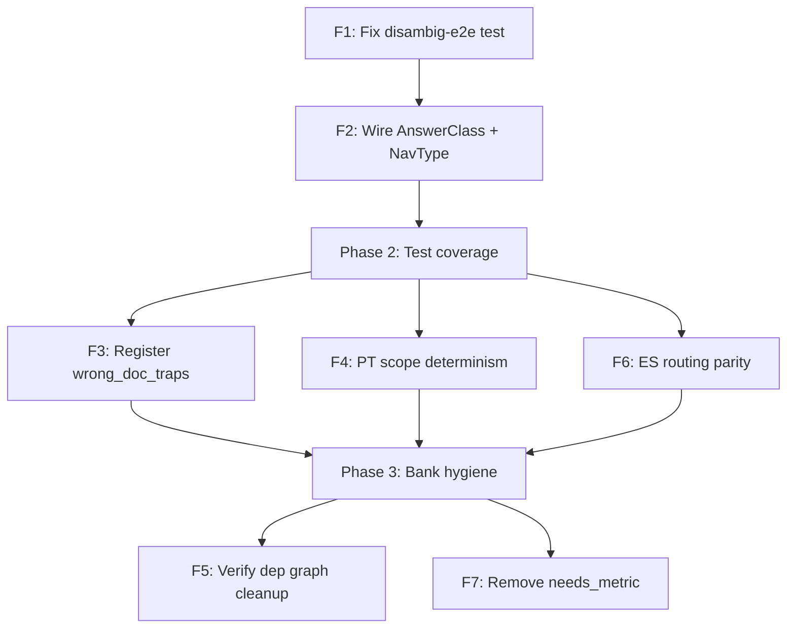

<!-- b6d0dc33-469a-4833-a387-0aa96b88af18 -->
---
todos:
  - id: "f1-disambig-fix"
    content: "F1: Fix disambiguation-e2e cert -- correct bank shape + provide docAliasPhrases in test"
    status: pending
  - id: "f2-answerclass-navtype"
    content: "F2: Wire AnswerClass NAVIGATION for nav_pills + resolve NavType from operator_families bank in both delegates"
    status: pending
  - id: "f3-wrong-doc-traps-registry"
    content: "F3: Register wrong_doc_traps.qa.jsonl in suite_registry, verify schema compliance"
    status: pending
  - id: "f4-pt-scope-determinism"
    content: "F4: Add PT scope determinism scenarios + PT version-hint extraction tests"
    status: pending
  - id: "f5-verify-dep-cleanup"
    content: "F5: Verify bank_dependencies legacy node removal is complete"
    status: pending
  - id: "f6-es-routing-parity"
    content: "F6: Add ES column to routing-parity-behavioral test pairs"
    status: pending
  - id: "f7-needs-metric-cleanup"
    content: "F7: Remove dead needs_metric reason code from ScopeReasonCode type"
    status: pending
isProject: false
---
# Intent Routing & Scope Control -- Implementation Plan

## Audit Findings Summary (8 findings, ranked by severity)

### F1. BLOCKER -- disambiguation-e2e cert gate FAILING (2 failures)

**Root cause (confirmed):** `disambiguation-e2e.cert.test.ts` line 92 provides `disambiguation_policies` bank with thresholds at `config.thresholds.*`, but `ScopeGateService` (line 682-686) reads from `config.actionsContract.thresholds.*`. This means `ambiguityThresholds` resolves to `{}` and all values fall back to defaults. More critically, the query "open the quarterly report" never triggers `explicitDocRef` because `docAliasPhrases` is `[]` and the query has no file extension -- so the disambiguation flow is never entered.

**Two sub-fixes:**
- a) Test bank shape: change `config.thresholds` to `config.actionsContract.thresholds` to match what `ScopeGateService` actually reads.
- b) Test setup: provide `docAliasPhrases` that include "report" so the query "open the quarterly report" triggers `explicitDocRef` via `matchesAnyDocAliasPhrase`.

**Files:**
- `backend/src/tests/certification/disambiguation-e2e.cert.test.ts` (lines 92-107, 122-128)

---

### F2. BLOCKER -- AnswerClass "NAVIGATION" and NavType are configured but never wired

**Root cause (confirmed):** 
- v1 delegate (`CentralizedChatRuntimeDelegate.ts` line 2196-2197): `answerMode === "general_answer" ? "GENERAL" : "DOCUMENT"` -- nav_pills maps to `DOCUMENT`, not `NAVIGATION`.
- v2 delegate (`CentralizedChatRuntimeDelegate.v2.ts` line 268-270): `resolveAnswerClassFromMode` returns `DOCUMENT` or `GENERAL` only.
- Both delegates hardcode `navType: NavType = null` everywhere.
- `operator_families.any.json` defines `ui.navType` per operator but runtime never reads it.
- Provenance test at line 447 expects `answerClass: "NAVIGATION"` for `nav_pills` -- this is the correct intent but the production code disagrees.

**Fix:**
- `resolveAnswerClassFromMode` (v2) and equivalent (v1): add `nav_pills` -> `"NAVIGATION"`.
- Both delegates: resolve `navType` from `req.meta.operator` via `operator_families` bank lookup instead of hardcoding `null`.

**Files:**
- `backend/src/modules/chat/runtime/CentralizedChatRuntimeDelegate.ts` (~6 occurrences of `navType: null`)
- `backend/src/modules/chat/runtime/CentralizedChatRuntimeDelegate.v2.ts` (function `resolveAnswerClassFromMode` + ~6 occurrences)
- `backend/src/services/config/answerModeRouter.service.ts` (add NavType resolver or export helper)

---

### F3. HIGH -- wrong_doc_traps.qa.jsonl not in eval suite registry (62 cases, never executed)

**Root cause:** File exists at `backend/src/data_banks/document_intelligence/eval/wrong_doc_traps.qa.jsonl` but is not listed in `backend/src/data_banks/document_intelligence/eval/suites/suite_registry.any.json`. The docint-eval-pack test runner only executes registered suites.

**Fix:** Add entry to `suite_registry.any.json` under `nightly_suites` (schema requires `lang`, `domain`, `docTypeId`, `queryFamily` -- verify JSONL has them or add a schema-compatible wrapper).

**Files:**
- `backend/src/data_banks/document_intelligence/eval/suites/suite_registry.any.json`
- Possibly `backend/src/data_banks/document_intelligence/eval/wrong_doc_traps.qa.jsonl` (if schema fields are missing)

---

### F4. HIGH -- Scope determinism tests are EN-only; PT scope behavior unproven

**Root cause:** `scope-expansion-determinism.cert.test.ts` uses `userLanguage: "en"` and English queries in all 5 scenarios. No PT queries test scope lock, followup continuity, or version resolution.

**Fix:** Duplicate the 5 scenarios with PT queries and `userLanguage: "pt"`. Also add PT version-hint extraction tests to `scopeGate.service.test.ts`.

**Files:**
- `backend/src/tests/certification/scope-expansion-determinism.cert.test.ts`
- `backend/src/services/core/scope/scopeGate.service.test.ts` (add PT version hint tests)

---

### F5. HIGH -- 51 phantom nodes in bank_dependencies will crash strict boot

**Root cause:** `bank_dependencies.any.json` previously had `legacy_legal_*` and `legacy_medical_*` nodes. The current diff shows these are being REMOVED (lines prefixed with `-`). This is already in-progress on the branch. Need to verify the removal is complete and no orphan edges remain.

**Validation:** Run `validateDependencyGraphIntegrity()` or a quick script counting nodes in dependencies vs registry.

**Files:**
- `backend/src/data_banks/manifest/bank_dependencies.any.json` (verify diff is complete)

---

### F6. MEDIUM -- ES routing parity has zero test pairs

**Root cause:** `routing-parity-behavioral.cert.test.ts` only has EN/PT columns. The collision matrix has ES regex vectors (passing), but no ES routing parity is proven.

**Fix:** Add ES column to the 22 routing parity pairs.

**Files:**
- `backend/src/tests/certification/routing-parity-behavioral.cert.test.ts`

---

### F7. MEDIUM -- needs_metric reason code declared but never emitted

**Root cause:** `ScopeGateService` declares `needs_metric` in the `ScopeReasonCode` type (line 58) but never emits it. No extraction logic for metric slots exists.

**Fix:** Either remove the dead reason code or implement metric-hint extraction (lower priority; mark as tech debt).

**Files:**
- `backend/src/services/core/scope/scopeGate.service.ts` (line 58)

---

### F8. LOW -- runtime-wiring cert gate failing (RUNTIME_GRAPH_COMMAND_FAILED)

**Root cause:** The gate report shows `commandStatus: 1` -- the graph analysis command itself failed (likely a tooling/environment issue, not a code bug). All actual metrics pass thresholds (coverage 93%, 0 missing refs, 0 legacy wrappers).

**Fix:** Investigate and fix the graph command; this is not a routing/scope issue per se.

---

## Implementation Phases

### Phase 1: Fix P0 blockers (F1 + F2)

**F1 -- Fix disambiguation-e2e cert test (est. 30 min)**

In `disambiguation-e2e.cert.test.ts`:
1. Change `makeDocIntelligenceBanks()` to return `getDocAliasPhrases: () => ["report", "quarterly"]` so the scope gate's `matchesAnyDocAliasPhrase` detects "open the quarterly report" as an explicit doc reference.
2. Change `makeBankLoader()`'s `disambiguation_policies` return to nest thresholds under `config.actionsContract.thresholds` to match the scope gate's read path.

Validation: `npx jest disambiguation-e2e.cert` must pass all 5 steps. Gate report must show `passed: true`.

Rollback: Revert test file only; no production code changes.

**F2 -- Wire AnswerClass NAVIGATION + NavType (est. 2 hr)**

1. In `CentralizedChatRuntimeDelegate.v2.ts`, change `resolveAnswerClassFromMode`:

```typescript
function resolveAnswerClassFromMode(answerMode: AnswerMode): AnswerClass {
  const mode = String(answerMode || "");
  if (mode.startsWith("doc_grounded")) return "DOCUMENT";
  if (mode === "nav_pills" || mode === "nav_pill") return "NAVIGATION";
  return "GENERAL";
}
```

2. In `CentralizedChatRuntimeDelegate.ts`, apply equivalent logic (replace `answerMode === "general_answer" ? "GENERAL" : "DOCUMENT"` with 3-way check).

3. Add a `resolveNavType` helper that reads `operator_families` bank for the matched operator's `ui.navType`, defaulting to `null`. Use it instead of hardcoded `null` at all 6+ assignment sites in each delegate.

4. Add unit test asserting `nav_pills` -> `NAVIGATION` and `navType` resolves correctly.

Validation: Existing provenance test (line 447 expects `NAVIGATION`) should now pass without special mocking. Run full cert suite.

Rollback: Revert the two delegate files + answerModeRouter.

Acceptance: `answerClass === "NAVIGATION"` when `answerMode === "nav_pills"`, `navType` equals operator's `ui.navType`.

---

### Phase 2: Fix test coverage gaps (F3 + F4 + F6)

**F3 -- Register wrong_doc_traps in eval suite (est. 45 min)**

1. Verify `wrong_doc_traps.qa.jsonl` has required schema fields (`lang`, `domain`, `docTypeId`, `queryFamily`). If missing, add them.
2. Add entry to `suite_registry.any.json` `nightly_suites` array.

Validation: `npx jest docint-eval-pack` must include wrong_doc_traps cases.

**F4 -- PT scope determinism tests (est. 1 hr)**

Add a `describe("PT scope determinism")` block to `scope-expansion-determinism.cert.test.ts` with 5 PT-translated scenarios:
- "o que diz sobre receita?" (hard lock followup)
- "resuma isso" (bare pronoun followup)
- "agora olhe ContractB.pdf" (explicit switch)
- "o primeiro" (discovery followup)
- "qual tem mais receita?" (compare followup)

Also add PT version-hint tests to `scopeGate.service.test.ts`:
- "Abra a versao vigente" -> `versionAnchor: "current"`
- "Abra a copia assinada" -> `signatureStateHint: "signed"`

Validation: Both test files pass. Gate report `routing-determinism` must increase `scopeScenariosTested` from 5 to 10.

**F6 -- ES routing parity (est. 1 hr)**

Add ES translations to the 22 pairs in `routing-parity-behavioral.cert.test.ts`. Update test to iterate `["en", "pt", "es"]`.

Validation: `npx jest routing-parity-behavioral` passes with 66 assertions (22 x 3 locales).

---

### Phase 3: Bank hygiene (F5 + F7)

**F5 -- Verify bank_dependencies cleanup (est. 15 min)**

Verify the current diff fully removes all 51 phantom `legacy_*` nodes. Run the dependency graph validation manually or via `npx jest bank-preload-alignment`.

**F7 -- Remove or annotate needs_metric (est. 10 min)**

Remove `needs_metric` from the `ScopeReasonCode` union type, or add a `// TODO: implement metric-hint extraction` comment and leave it. Prefer removal if no downstream code references it.

---

## Dependency Graph (execution order)



## Acceptance Criteria (per-finding)

- F1: `disambiguation-e2e` gate report shows `passed: true`, all 5 steps pass
- F2: `nav_pills` -> `answerClass: "NAVIGATION"`, `navType` resolves from operator bank, provenance test passes
- F3: `wrong_doc_traps` appears in eval-pack output with 62 cases validated
- F4: `scope-expansion-determinism` gate report shows `scopeScenariosTested >= 10`
- F5: `bank-preload-alignment` cert passes with 0 unknown nodes
- F6: `routing-parity-behavioral` passes with `localesCovered >= 3`
- F7: No dead reason code in `ScopeReasonCode` type

## Global Validation

After all phases: run full cert suite (`npx jest --testPathPattern=cert`). Target: 19/24 gates passing (current: 17/24, fixes should bring runtime-wiring and disambiguation-e2e green).
