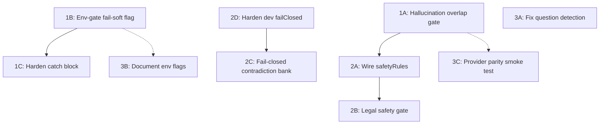

<!-- 59e39ea1-2f93-4ec3-81e3-6ae2ad9fc32f -->
---
todos:
  - id: "p1a-hallucination-overlap"
    content: "Phase 1A: Add token-overlap grounding check to hallucination_risk gate in qualityGateRunner.service.ts"
    status: pending
  - id: "p1b-env-gate-failsoft"
    content: "Phase 1B: Env-gate CHAT_RUNTIME_FAIL_SOFT_WARNINGS to non-production in both CentralizedChatRuntimeDelegate files"
    status: pending
  - id: "p1c-harden-catch"
    content: "Phase 1C: Harden quality gate runner catch block to always fail-closed in production"
    status: pending
  - id: "p2a-wire-safety-rules"
    content: "Phase 2A: Wire safetyRules from DI banks into runDomainSpecificOverrideGates"
    status: pending
  - id: "p2b-legal-safety-gate"
    content: "Phase 2B: Add legal_safety_boundaries gate + bank severity entry"
    status: pending
  - id: "p2c-contradiction-failclosed"
    content: "Phase 2C: Fail closed on missing contradiction_policy bank in strict mode"
    status: pending
  - id: "p2d-harden-dev-failclosed"
    content: "Phase 2D: Guard isStrictFailClosedMode against NODE_ENV misconfiguration"
    status: pending
  - id: "p3a-fix-question-detect"
    content: "Phase 3A: Replace raw ? count with sentence-level question detection"
    status: pending
  - id: "p3b-doc-env-flags"
    content: "Phase 3B: Document QUALITY_GATES_ENFORCING and FAIL_SOFT flags in .env.example"
    status: pending
  - id: "p3c-provider-parity-test"
    content: "Phase 3C: Add provider parity structural certification test"
    status: pending
isProject: false
---
# LLM Governance & Quality Gates — Hardening Plan

## Cross-Referenced Evidence Summary

| Finding ID | Root Cause | Affected File(s) | Severity | Certification Gate Impact |
|---|---|---|---|---|
| F-01 | Hallucination gate uses only regex heuristic; no semantic grounding check | `qualityGateRunner.service.ts:955-979` | P0 | `provenance-strictness` cert may mask this |
| F-02 | `CHAT_RUNTIME_FAIL_SOFT_WARNINGS` env flag can downgrade all non-hard gates to advisory | `CentralizedChatRuntimeDelegate.ts:3979`, `.v2.ts:4001` | P0 | `enforcer-failclosed` cert does not cover this vector |
| F-03 | Quality gate runner crash in try/catch can degrade to warning when fail-soft is on | `CentralizedChatRuntimeDelegate.ts:4210-4246`, `.v2.ts` same region | P0 | Partially covered by `enforcer-failclosed` cert but only for enforcer, not gate runner |
| F-04 | Legal safety rules (`legal_safe_001`-`005`) exist in bank but `safetyRules` key is never read by quality gate runner | `qualityGateRunner.service.ts` (no `safetyRules` reference), `legal/redaction_and_safety_rules.any.json:74-110` | P1 | No cert test covers this |
| F-05 | No `legal_safety_boundaries` gate equivalent to `medical_safety_boundaries` | `qualityGateRunner.service.ts:2069-2114` (medical exists, legal absent) | P1 | No cert test covers this |
| F-06 | Missing `contradiction_policy` bank silently passes in strict mode | `qualityGateRunner.service.ts:2027-2030` | P1 | No cert test covers this |
| F-07 | Single-question detection uses raw `?` character count, not sentence-level detection | `qualityGateRunner.service.ts:1999-2002` | P2 | `disambiguation-e2e` cert does not test edge cases |
| F-08 | No cross-provider output structural parity validation | `llmRouter.service.ts` (routing only), no parser/normalizer exists | P2 | `composition-routing` cert tests routing, not output equivalence |
| F-09 | `failClosed: false` for dev/local in quality_gates bank allows advisory-only gates if `NODE_ENV` misconfigured | `quality_gates.any.json:33-49` | P1 | `routing-determinism` cert does not test env boundary |
| F-10 | Env flags `QUALITY_GATES_ENFORCING`, `CHAT_RUNTIME_FAIL_SOFT_WARNINGS` not documented in any `.env` file | No `.env.example` entry | P2 | Operational risk, not code bug |

### Assumptions

- The `DocumentIntelligenceBanksService.getRedactionAndSafetyRules()` returns the full bank JSON including both `redactionRules` and `safetyRules` arrays (confirmed by reading `legal/redaction_and_safety_rules.any.json`)
- The existing `enforcer-failclosed.cert.test.ts` pattern is the accepted template for new cert tests
- The `provenance-strictness.cert.test.ts` uses snippet hash + coverage score, not semantic overlap against the generated answer text (confirmed by grep — it validates evidence map integrity, not answer-evidence alignment)
- The `refusalPolicy.service.ts` rule `RP_860` is the only legal/medical safety boundary in the pre-retrieval path; quality gates are the post-generation path

### Constraints

- Both `CentralizedChatRuntimeDelegate.ts` and `CentralizedChatRuntimeDelegate.v2.ts` must be kept in sync (same changes applied to both files)
- Bank JSON changes must update `bank_checksums.any.json` and `bank_registry.any.json` (SSOT governance)
- Certification summary currently shows 17/24 gates passed; changes must not regress existing passing gates
- No external dependencies should be added for semantic overlap (use token-level Jaccard which is already precedented by `tokenOverlap` in `scopeGate.service.ts`)

---

## Phase 1 — P0 Blockers (Risk: Critical, Effort: ~3 days)

### 1A. Seal the hallucination gate with token-overlap grounding check

**Finding:** F-01
**File:** `backend/src/services/core/enforcement/qualityGateRunner.service.ts`
**Location:** Lines 955-979, `hallucination_risk` gate inside `evaluateConfiguredGate`

**Change:** After the existing speculative-language check, add a token-level Jaccard overlap check between `response` and the concatenated evidence snippets. Use the same `splitSentences` helper already in the file. If overlap on 3-gram shingles is below 0.10 and evidence count > 0 and mode is `doc_grounded*`, fail the gate.

**Why token-overlap, not embeddings:** Zero new dependencies; deterministic; already precedented by `tokenOverlap()` in `scopeGate.service.ts:303-310`. Embeddings can be added later as a P3 enhancement.

**Rollback:** Revert the function body; gate returns to heuristic-only. Feature flag `HALLUCINATION_OVERLAP_GATE` with default `true` for safe rollback.

**Validation:**
- New unit test: confident hallucination with unrelated evidence snippet must fail
- New unit test: legitimate doc-grounded answer with matching evidence must pass
- Existing test "executes configured doc grounding gate and fails without evidence" must still pass

---

### 1B. Environment-gate the fail-soft flag to non-production only

**Finding:** F-02
**Files:**
- `backend/src/modules/chat/runtime/CentralizedChatRuntimeDelegate.ts` (line 3979)
- `backend/src/modules/chat/runtime/CentralizedChatRuntimeDelegate.v2.ts` (line 4001)

**Change:** Replace:

```typescript
const failSoftWarningsEnabled = isRuntimeFlagEnabled(
  "CHAT_RUNTIME_FAIL_SOFT_WARNINGS",
  false,
);
```

With:

```typescript
const failSoftWarningsEnabled =
  normalizeEnv() !== "production" &&
  normalizeEnv() !== "staging" &&
  isRuntimeFlagEnabled("CHAT_RUNTIME_FAIL_SOFT_WARNINGS", false);
```

**Rollback:** Revert the two lines. No feature flag needed — this is a security hardening.

**Validation:**
- New cert test: `quality-gate-failsoft-blocked-in-prod.cert.test.ts` — set `NODE_ENV=production` + `CHAT_RUNTIME_FAIL_SOFT_WARNINGS=true`, assert blocking gates still fail-closed
- Existing `enforcer-failclosed.cert.test.ts` must still pass

---

### 1C. Harden quality gate runner catch block in production

**Finding:** F-03
**Files:** Same two as 1B

**Change:** In the catch block (line ~4210), before checking `resolveRuntimeFailureMode`, add an early return for production:

```typescript
} catch (error) {
  appLogger.warn("[finalizeChatTurn] Quality gate runner error", { ... });
  const reasonCode = "quality_gate_runner_error";
  if (!failureCode) {
    // Always fail closed in prod/staging regardless of failSoftWarningsEnabled
    const isProdOrStaging = ["production", "staging"].includes(normalizeEnv());
    const failureMode = isProdOrStaging
      ? "fail_closed" as const
      : resolveRuntimeFailureMode(reasonCode, failSoftWarningsEnabled);
```

**Rollback:** Revert the conditional.

**Validation:**
- Extend `enforcer-failclosed.cert.test.ts` with a new test case: "runtime returns safe fallback when quality gate runner throws in production"

---

## Phase 2 — P1 Enforcement Gaps (Risk: High, Effort: ~3 days)

### 2A. Wire `safetyRules` from DI banks into quality gate runner

**Finding:** F-04
**File:** `backend/src/services/core/enforcement/qualityGateRunner.service.ts`
**Location:** `runDomainSpecificOverrideGates`, lines 2197-2230

**Change:** After the existing `redactionRules` loop, add a parallel loop for `safetyRules`:

```typescript
if (Array.isArray(safetyBank?.safetyRules)) {
  for (const rule of safetyBank.safetyRules) {
    if (String(rule?.severity || "").toLowerCase() !== "error") continue;
    results.push({
      gateName: `domain_safety_rule_${String(rule?.id || "unknown")}`,
      passed: false, // trigger-based rules are evaluated by presence, not regex
      score: 0,
      actionOnFail: String(rule?.action || "").includes("BLOCK")
        ? "emit_adaptive_failure_message"
        : undefined,
      reasonCode: "policy_refusal_required",
      issues: [String(rule?.description || "Safety rule triggered.")],
      sourceBankId: safetyBank?._meta?.id,
    });
  }
}
```

**Important caveat:** The current `safetyRules` have human-language `trigger` fields (e.g., "user asks to alter source wording"), not machine-evaluable expressions. Phase 2A wires the plumbing; actual trigger evaluation requires either (a) converting triggers to regex/expression patterns like `redactionRules`, or (b) upstream intent signals. For now, mark this as "wiring only" — the safety rules will be evaluated when upstream signals are present.

**Better approach for Phase 2A:** Add a `legal_safety_boundaries` gate (see 2B) that uses regex patterns mirroring the medical gate, and convert `safetyRules` triggers to regex in a follow-up.

**Rollback:** Revert the new loop. No bank changes needed.

---

### 2B. Add `legal_safety_boundaries` gate

**Finding:** F-05
**File:** `backend/src/services/core/enforcement/qualityGateRunner.service.ts`
**Location:** After line 2114 (end of medical gate block)

**Change:** Add:

```typescript
if (domain === "legal") {
  const hardLegalAdvice =
    /\b(you should sue|file a lawsuit|this constitutes|legally binding|I advise you to|you are entitled to|this is not legal advice but|you have a strong case|guaranteed to win)\b/i.test(
      responseText,
    );
  const hasSafetyQualifier =
    /\b(consult|attorney|lawyer|legal counsel|seek professional|advogado|consulte|abogado)\b/i.test(
      responseText,
    );
  if (hardLegalAdvice && !hasSafetyQualifier) {
    results.push({
      gateName: "legal_safety_boundaries",
      passed: false,
      score: 0.1,
      actionOnFail: "emit_adaptive_failure_message",
      reasonCode: "policy_refusal_required",
      issues: [
        "Legal response contains advice language without safety qualifier.",
      ],
    });
  }
}
```

**File:** `backend/src/data_banks/quality/quality_gates.any.json`
**Change:** Add `"legal_safety_boundaries": "block"` to `config.gateSeverityByName`.

**Rollback:** Revert the code block + JSON entry.

**Validation:**
- New unit test: "legal advice without safety qualifier fails gate"
- New unit test: "legal summary with consult-an-attorney qualifier passes"
- New unit test: "non-legal domain response with lawsuit mention passes" (no false positive)

---

### 2C. Fail closed on missing contradiction_policy bank in strict mode

**Finding:** F-06
**File:** `backend/src/services/core/enforcement/qualityGateRunner.service.ts`
**Location:** Line 2027-2030

**Change:** Add a guard before the existing block:

```typescript
const contradictionPolicyBank = getOptionalBank<ContradictionPolicyBank>(
  "contradiction_policy",
);
if (!contradictionPolicyBank && strictFailClosed) {
  throw new Error(
    "Required contradiction_policy bank is missing in strict fail-closed mode",
  );
}
```

This requires passing `strictFailClosed` into `runDocumentIntelligencePolicyGates`. Add it as a parameter.

**Rollback:** Remove the guard.

**Validation:**
- New unit test: "throws when contradiction_policy bank missing in production"
- New unit test: "warns but does not throw in dev when contradiction_policy missing"

---

### 2D. Harden dev/local failClosed config against env misconfiguration

**Finding:** F-09
**File:** `backend/src/services/core/enforcement/qualityGateRunner.service.ts`
**Location:** `isStrictFailClosedMode`, lines 771-781

**Change:** Add a safety check: if `env` resolves to `dev` or `local` but `process.env.NODE_ENV` is literally `"production"`, override to fail-closed:

```typescript
private isStrictFailClosedMode(qualityBank: QualityGatesBank | null): boolean {
  const env = resolveRuntimeEnv();
  const byEnv = qualityBank?.config?.modes?.byEnv;
  const configured = byEnv?.[env];
  if (typeof configured?.failClosed === "boolean") {
    // Safety: never allow failClosed=false if actual NODE_ENV is production
    if (!configured.failClosed && process.env.NODE_ENV === "production") {
      return true;
    }
    return configured.failClosed;
  }
  return env === "production" || env === "staging";
}
```

**Rollback:** Revert the inner conditional.

---

## Phase 3 — P2 Improvements (Risk: Medium, Effort: ~2 days)

### 3A. Fix single-question detection to use sentence-level analysis

**Finding:** F-07
**File:** `backend/src/services/core/enforcement/qualityGateRunner.service.ts`
**Location:** Lines 1999-2002

**Change:** Replace raw `?` count with sentence-level question detection:

```typescript
const questionSentences = splitSentences(responseText).filter(
  (s) => /\?\s*$/.test(s.trim()),
);
const invalidClarifierCount =
  requiresSingleQuestion && questionSentences.length !== 1;
```

**Rollback:** Revert to `(responseText.match(/\?/g) || []).length`.

**Validation:**
- Existing test "fails ambiguity single-question policy when clarification has zero questions" must still pass
- New test: "URL with ? in body does not count as question"
- New test: "two genuine question sentences fails single-question policy"

---

### 3B. Document env flags in `.env.example`

**Finding:** F-10
**File:** `backend/.env.example`

**Change:** Add documented entries:

```
# Quality gate enforcement (default: true). Set to false ONLY for local debugging.
QUALITY_GATES_ENFORCING=true

# Fail-soft warnings mode (default: false). Blocked in production/staging.
CHAT_RUNTIME_FAIL_SOFT_WARNINGS=false
```

**Rollback:** Remove the lines.

---

### 3C. Add provider parity smoke test (structural)

**Finding:** F-08
**File:** New cert test `backend/src/tests/certification/provider-parity-structural.cert.test.ts`

**Change:** Create a certification test that validates the quality gate runner produces the same pass/fail verdicts regardless of which provider was used (by running the same gate context through the runner twice with different telemetry.model values). This does not require calling actual LLMs — it proves that quality enforcement is provider-agnostic.

**Rollback:** Delete the test file.

---

## Dependency Graph



Phase 1 tasks (1A, 1B, 1C) are independent of each other and can be parallelized.
Phase 2 tasks depend on Phase 1 completions as shown.
Phase 3 tasks can proceed any time after their Phase 1 dependency.

## Acceptance Criteria

- All existing 401 quality gate runner tests pass (0 regressions)
- All existing 49 certification tests pass (0 regressions)
- New cert test `quality-gate-failsoft-blocked-in-prod` passes
- New unit tests for F-01, F-04, F-05, F-06, F-07 all pass
- `certification-summary.md` gate count remains >= 17/24 (no regression)
- `CHAT_RUNTIME_FAIL_SOFT_WARNINGS=true` in production has zero effect on blocking gates
- Legal domain responses with advice language and no disclaimer are blocked
- Missing `contradiction_policy` bank in production throws (not silently passes)
- Hallucination gate fails when answer tokens have < 10% overlap with evidence tokens in doc-grounded mode
